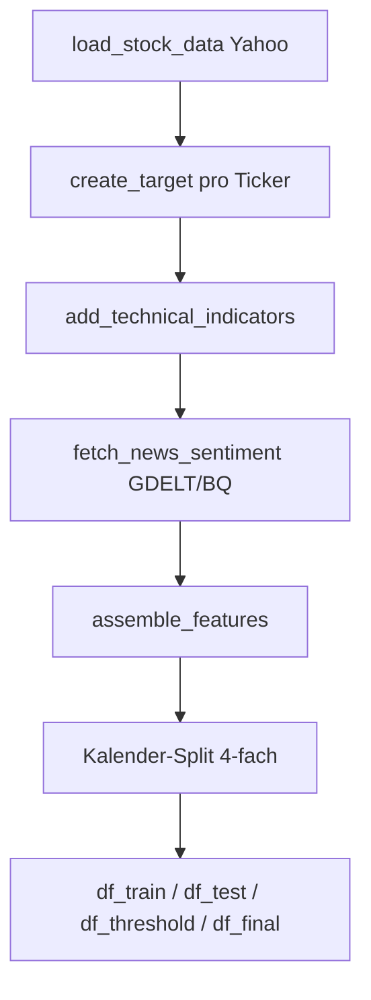
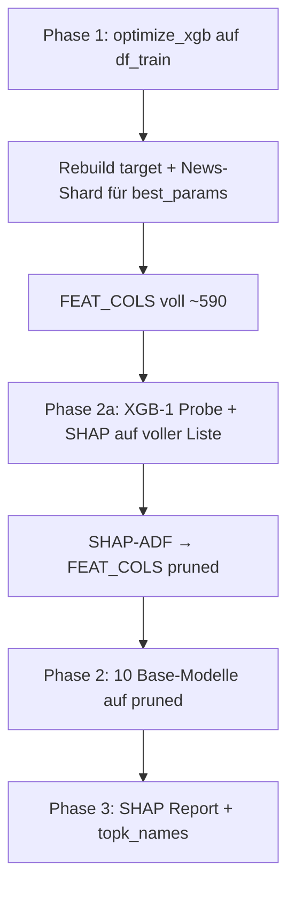

# Pipeline-Übersicht: stock_rally V10 (detailliert)

Dieses Dokument beschreibt **Schritt für Schritt**, was die Pipeline tut, welche Daten wo landen, wie Modelle trainiert werden und wie ein exportiertes Signal entsteht. Es ergänzt die technische Referenz [`SYSTEM_REFERENZ.md`](SYSTEM_REFERENZ.md) und die V11-Roadmap [`V11_ROADMAP.md`](V11_ROADMAP.md).

**Zielgruppe:** Du willst einen Lauf nachvollziehen, Parameter setzen oder einen Reviewer-Kommentar (z. B. „Meta nur 2000 Zeilen?“) gegen den Code prüfen.

---

## Inhaltsverzeichnis

1. [Glossar & Namensräume](#1-glossar--namensräume)
2. [Einstieg: `pipeline_runner.py`](#2-einstieg-pipeline_runnerpy)
3. [Konfiguration (`config_settings.py` → `config.py`)](#3-konfiguration-config_settingspy--configpy)
4. [Schritt 0: Daten bis zum Kalender-Split](#4-schritt-0-daten-bis-zum-kalender-split)
5. [Die vier Kalender-Fenster (Leakage-Schutz)](#5-die-vier-kalender-fenster-leakage-schutz)
6. [Zielvariable `target` (Label)](#6-zielvariable-target-label)
7. [Feature-Engineering (`FEAT_COLS`)](#7-feature-engineering-feat_cols)
8. [Phase 12 — Base (Optuna, ADF, 10 Modelle)](#8-phase-12--base-optuna-adf-10-modelle)
9. [Phase 13 — Meta-Learner & Phase 5 (Schwelle)](#9-phase-13--meta-learner--phase-5-schwelle)
10. [Phasen 14–17 — Reports, Holdout, Website](#10-phasen-1417--reports-holdout-website)
11. [Vom Modell zum Handelssignal](#11-vom-modell-zum-handelssignal)
12. [Artefakte & Persistenz](#12-artefakte--persistenz)
13. [Laufmodi-Matrix](#13-laufmodi-matrix)
14. [FAQ / typische Missverständnisse](#14-faq--typische-missverständnisse)
15. [Anhang: SHAP-Ranglisten](#15-anhang-shap-ranglisten) *(dynamisch ergänzt)*

---

## 1. Glossar & Namensräume

| Begriff | Bedeutung im Code |
|--------|-------------------|
| **`cfg` / `config`** | Ein gemeinsamer Python-Namespace: `from lib.stock_rally_v10 import config as cfg`. `config_settings.py` wird per `import *` eingebunden; Laufzeit-Variablen (DataFrames, Modelle) hängen als Attribute an `cfg`. |
| **`df_train`** | Zeilen des **BASE**-Kalenders (Phase 12: Optuna + Base-Modelle). |
| **`df_test`** | Zeilen des **META**-Kalenders (Phase 13: Meta-Learner). Historischer Name „test“ = Meta-Trainingsfenster, nicht FINAL-OOS. |
| **`df_threshold`** | Kalender nur für **Schwellen-Kalibrierung** (Phase 5 Grid auf THRESHOLD). |
| **`df_final`** | Echter **Out-of-Sample**-Kalender für Website/`signals.json`/Holdout-Plots. |
| **`FEAT_COLS`** | Liste der Spaltennamen, die Base-Modelle als Input nutzen (nach ADF: geprünte Liste). |
| **`FEAT_COLS_FULL`** | Volle Spaltenliste vor ADF (nur Phase 12 intern / Report). |
| **`topk_names`** | Roh-Features für Meta-Stack (35 Stück), aus Base-SHAP-Masse gewählt. |
| **`best_params`** | Dict der Base-Optuna-Gewinner (Fenster, News-Tag, XGB-Hyperparameter, Filter für Base-CV). |
| **`best_threshold`** | Produktive Wahrscheinlichkeitsschwelle auf Meta-`prob` (Phase 5 auf THRESHOLD). |
| **`prob`** | Spalte mit Meta-Wahrscheinlichkeit (ggf. kalibriert) pro Zeile. |

**Zeilenebene:** Jede Zeile = ein **Ticker an einem Handelstag** (nach Split). Es gibt keine „eine Zeile pro Tag für den ganzen Markt“, sondern Ticker × Datum.

---

## 2. Einstieg: `pipeline_runner.py`

```text
bind_step_functions()          # Hängt Hilfsfunktionen an cfg (load_stock_data, create_target, …)
cfg.log_pipeline_mode_banner()
run_data_download_and_split()  # → cfg.df_train, df_test, df_threshold, df_final, …
run_training_scoring_and_export()  # Phasen 12–17
```

| Schritt | Modul | Output auf `cfg` |
|--------|--------|------------------|
| Daten | `data_and_split.run_data_download_and_split` | `df_features`, Split → `df_train`, `df_test`, `df_threshold`, `df_final` |
| Training | `training_phases.run_training_scoring_and_export` | Modelle, `best_threshold`, `FEAT_COLS`, Artefakt-Save |

**Wichtig:** Alles läuft über **`config_settings.py`** (importiert als `cfg`). Notebook-Variablen allein reichen nicht.

---

## 3. Konfiguration (`config_settings.py` → `config.py`)

### 3.1 Laufmodus (entscheidend vor Start)

| Variable | Default (prüfen!) | Wirkung |
|----------|-------------------|--------|
| `SCORING_ONLY` | oft `True` im Repo | **Kein Training** — lädt Artefakt, macht Scoring/Website. Für ADF-Lauf: **`False`**. |
| `RETRAIN_META_ONLY` | `False` | `True` → Phase 12 übersprungen, Base aus `scoring_artifacts.joblib`. |
| `SKIP_META_OPTUNA` | `False` | Meta-Optuna überspringen, Checkpoint laden. |
| `SHAP_ADF_ENABLED` | `True` | ADF-Pipeline aktiv (siehe §8). |
| `SHAP_ADF_REPLACE_FEAT_COLS` | `True` | Nach ADF trainieren **alle** Base-Modelle auf geprüfter `FEAT_COLS`. |

### 3.2 Optuna & CV

| Variable | Typische Werte | Rolle |
|----------|----------------|------|
| `N_OPTUNA_TRIALS` | 150 | Base-Optuna-Trials (TPE). |
| `N_META_TRIALS` | 150 | Meta-Optuna-Trials. |
| `N_WF_SPLITS` | 5 | Walk-Forward-Folds in Base- und Meta-CV. |
| `OPTUNA_WF_SPLITS` | `None` → 5 | Optional weniger Base-Folds. |
| `OPT_MODEL_HYPERPARAMS` | `True` | Base-Optuna sucht XGB-`max_depth`, `learning_rate`, Focal-`gamma`, … |
| `OPT_OPTIMIZE_Y_TARGETS` | `False` | `True` würde Label-Parameter mit-suchen (teuer). |

### 3.3 Precision-Gates (Optimierungsziel)

| Variable | Wert | Wo |
|----------|------|-----|
| `OPT_MIN_PRECISION_BASE` | 0.64 | Base-Optuna CV: gefilterte Signale pro Fold |
| `OPT_MIN_PRECISION_META` | 0.99 | Meta-Optuna CV + Phase-5-Logik |
| `_OPT_MAX_CONSEC_FP` | 4 | Max. aufeinanderfolgende False Positives pro Ticker |

Base belohnt **Recall bei Precision ≥ 64 %**; Meta **strenger (99 %)**.

### 3.4 Kalender-Split (`SPLIT_MODE=time`)

| Variable | Default | Anteil der *Inhalts*-Handelstage |
|----------|---------|----------------------------------|
| `TIME_SPLIT_FRAC_BASE` | 0.45 | BASE |
| `TIME_SPLIT_FRAC_META` | 0.35 | META |
| `TIME_SPLIT_FRAC_THRESHOLD` | 0.05 | THRESHOLD |
| *(Rest)* | ~0.15 | FINAL |
| `TIME_PURGE_TRADING_DAYS` | 5 | Lücke **zwischen** jedem Block |

Purge-Tage sind **keine Trainingsdaten** — verhindern, dass Labels/Features am Blockrand leaken.

---

## 4. Schritt 0: Daten bis zum Kalender-Split

Modul: `lib/stock_rally_v10/data_and_split.py` → `run_data_download_and_split()`.



### 4.1 Kurse (`load_stock_data`)

- Universum: `TICKERS_BY_SECTOR` (~285 Symbole), Download via `yfinance`.
- Zeitraum: `START_DATE` … `END_DATE` / `TRAIN_END_DATE`.
- Output: long format mit `Date`, `ticker`, OHLCV, ggf. Sektor-IDs.

### 4.2 Target (`create_target`)

- Ruft pro Ticker die **feste Band-Regel** auf (`FIXED_Y_*`, Modus `rally_plus_entry`), sofern `OPT_OPTIMIZE_Y_TARGETS=False`.
- Erzeugt Spalte **`target`** ∈ {0, 1} auf allen Zeilen **vor** dem Split (Target hängt nur vom Kursverlauf ab, nicht vom Split).

### 4.3 Technische Indikatoren (`add_technical_indicators`)

- Rolling Features: RSI, Bollinger, MACD, Vol-Stress, VCP, Blue-Sky, Drawdown, …
- Fenster sind **noch nicht** die Optuna-Gewinner — zunächst breite Berechnung für Cache.

### 4.4 News (`fetch_news_sentiment`)

- Quelle: `NEWS_SOURCE` (typisch BigQuery/GDELT).
- Ergebnis: `sentiment_df` / später Merge in `assemble_features`.
- Shards: `data/feature_shards_news/news_tag_*.parquet` (ein Parquet pro News-Parameter-Tripel).

### 4.5 Feature-Matrix (`assemble_features`)

- Join: Kurse + Indikatoren + News + Makro-Anreicherung (`augment_df_macro_regime_and_vol`).
- `cfg.FEAT_COLS` existiert nach Phase 12 final; vorher volles Raster aus `build_feature_cols`-Grids.
- Fehlende News: `FEATURE_NUMERIC_NAN_SENTINEL` (-1e8) + optional `news_missing`.

### 4.6 RETRAIN_META_ONLY beim Daten-Schritt

Wenn `RETRAIN_META_ONLY=True`, kann der News-/Feature-Build **leichtgewichtig** sein (`meta_only=True` in `assemble_features`) — volle News-Shards sind für Meta-Scoring dennoch nötig, wenn News-Features in `topk_names` stehen.

---

## 5. Die vier Kalender-Fenster (Leakage-Schutz)

Funktion: `_split_calendar_four_way` in `data_and_split.py`.

```text
Alle Handelstage ≤ TRAIN_END_DATE, sortiert:
[ BASE | purge | META | purge | THRESHOLD | purge | FINAL … ]
```

**Jeder Block** enthält **alle Ticker** × die Tage dieses Blocks (nicht unterschiedliche Ticker pro Phase im Zeit-Modus).

| DataFrame | Verwendung | Darf sehen |
|-----------|------------|------------|
| `df_train` | Base-Optuna, Base-Modelle, ADF-Probe | nur BASE-Tage |
| `df_test` | Meta-Optuna, Meta-Fit, Meta-SHAP | nur META-Tage |
| `df_threshold` | Phase-5 Threshold-Grid | nur THRESHOLD-Tage |
| `df_final` | Website, Holdout-Eval | nur FINAL-Tage |

**Warum getrennt?** Wenn Meta auf THRESHOLD trainieren würde, wäre die spätere Schwellenwahl auf demselben Kalender **in-sample** und optimistisch verzerrt.

Am Trainingsstart druckt `training_phases._log_training_partition_calendar` Min/Max-Datum und **Zeilenzahl** pro Block — dort siehst du die echte Meta-Größe (meist **viel mehr als 2000**).

---

## 6. Zielvariable `target` (Label)

Aktuell: **`OPT_OPTIMIZE_Y_TARGETS = False`**, **`FIXED_Y_LABEL_MODE = rally_plus_entry`**.

### 6.1 Ökonomische Idee

Das Modell soll Tage markieren, an denen ein **Einstieg am nächsten Open** in ein **kurzes Rally-Fenster** (2–8 Handelstage, ≥ **4,5 %** kumulativ) plausibel ist — nicht „jeder grüne Tag“.

### 6.2 Wichtige Parameter

| Parameter | Wert | Rolle |
|-----------|------|------|
| `FIXED_Y_WINDOW_MIN/MAX` | 2 / 8 | Länge des Forward-Fensters |
| `FIXED_Y_RALLY_THRESHOLD` | 0.045 | Mindest-Rendite im Fenster |
| `FIXED_Y_RALLY_PLUS_TARGET_SEGMENT_HEAD_FRACTION` | 0.35 | Nur **Kopf** der Rally (erste 35 % der Rally-Tage) = positiv |
| `FIXED_Y_RALLY_SIGNAL_ENTRY_DAYS` | 2 | Zusätzliche Vorlauf-Tage vor dem Kopf |
| `FIXED_Y_MAX_DIP_BELOW_ENTRY_FRACTION` | 0.015 | Max. 1,5 % unter Entry-Open auf dem Pfad |

### 6.3 Base-Optuna und Labels

Bei `OPT_OPTIMIZE_Y_TARGETS=False` wird das Label **einmal** vor Optuna gebaut; Trials **rebuilden** das Target nicht (spart Zeit). Meta/Base teilen dieselbe Label-Definition über alle Splits hinweg (nur Kalender filtert Zeilen).

---

## 7. Feature-Engineering (`FEAT_COLS`)

### 7.1 Wie Spalten entstehen

`cfg.build_feature_cols(rsi_w, bb_w, sma_w, news_mom_w, news_vol_ma, news_tone_roll, …)` in `config.py`:

1. **Technik** — `build_technical_cols`: Namen wie `rsi_21`, `bb_pband_20`, `yz_vol_60d`, …
2. **News** — `build_news_model_cols(tag)`: Hunderte Spalten pro News-Tag `mom_vol_tone` (z. B. `5_10_3` → `news_macro_5_10_3_tone`, GCAM-Themen, Lags, Z-Scores, Kreuzterme mit `mr_*`).
3. **Makro** — `append_macro_regime_vol_numeric_cols`: `mr_*`, `regime_*` (werden angehängt, nicht über RSI-Grid gesucht).

### 7.2 Optuna wählt **Fenster**, nicht einzelne Spalten

Pro Base-Trial wählt Optuna **ein Tripel** aus diskreten Grids (`config_settings.py`):

| Optuna-Parameter | Grid (Beispiel) |
|----------------|-----------------|
| `rsi_window` | 7, 10, 14, 21 |
| `bb_window` | 15, 20, 25 |
| `sma_window` | 30, 50, 70 |
| `news_mom_w` | 3, 5, 7 |
| `news_vol_ma` | 10, 20 |
| `news_tone_roll` | 3, 5, 10 |
| `yz_vol_window`, `adr_window`, … | je 2–3 Werte |

Daraus wird **ein** konsistentes `FEAT_COLS` für diesen Trial gebaut; XGB trainiert auf dieser Matrix.

### 7.3 Feature Pre-Screen (optional, vor Base-Optuna)

`FEATURE_PRESCREEN_ENABLED = True`:

- Läuft auf `df_train` (BASE).
- Walk-Forward + TreeSHAP + Boruta-Schatten → „Rauschboden“.
- Schreibt `data/feature_prescreen_v1.json`.
- Optuna nutzt `effective_window_grid('RSI_WINDOWS')` etc. — **eingeschränkte** Fenster, nicht einzelne Spalten-Subset pro Trial (außer News-Corr-Survivors).

### 7.4 News-Shards

- Pfad: `data/feature_shards_news/`.
- Pro News-Tag ein Parquet; Manifest `news_shards_manifest.json`.
- `NEWS_SHARDS_REUSE_SAME_CALENDAR_DAY=True`: max. ein Rebuild pro Tag.

---

## 8. Phase 12 — Base (Optuna, ADF, 10 Modelle)

Modul: `training_phases/optuna_base_models.py`.



### 8.1 Phase 1 — `optimize_xgb` (`optuna_train.py`)

**Daten:** nur `df_train` (BASE).

**Pro Trial (vereinfacht):**

1. Wähle Fenster-Parameter + (optional) XGB-Hyperparameter + `consecutive_days`, `signal_cooldown_days`, `base_eval_threshold`.
2. Baue `feat_cols = build_feature_cols(...)`, merge News-Shard für gewähltes Tripel.
3. **Walk-Forward** (`N_WF_SPLITS` Folds) auf BASE-Kalender:
   - Train XGB mit Focal Loss, Early Stopping auf innerem Holdout.
   - **Nested threshold** auf innerem Kalibrier-Split (`_pick_threshold_nested_base`).
   - Val-Fold: wende Filter an (`_apply_filters_cv`) → Score `_score_tp_precision_fold`.
4. Mittel der Fold-Scores → Optuna maximiert.

**Filter in Base-CV** (aus `SEED_PARAMS`, nicht trial-variiert): Anti-Peak, RSI-Max, Vol-Stress, Blue-Sky, dynamischer Threshold-Multiplikator — aber **nicht** die Meta-Optuna-Parameter `signal_skip_near_peak` als Trial.

**Gewinner:** `cfg.base_optuna_best_params` / `best_params` in Phase 12.

### 8.2 Rebuild nach Optuna

- `rebuild_target_for_train` auf train/test/threshold/final (bei festem Y oft identisch).
- News-Shard für Gewinner-Tag mergen.
- `FEAT_COLS` final aus Gewinner-Fenstern (~590 Spalten typisch).

### 8.3 Phase 2a — SHAP-Probe & ADF (`SHAP_ADF_ENABLED`)

**Zweck:** Feature-Ranking auf **voller** Liste, dann Streichen toter Spalten **bevor** die 10 teuren Base-Modelle trainieren.

| Schritt | Detail |
|--------|--------|
| Train | Nur **ein** XGB-1 auf **vollem** `X_train_all` (BASE). |
| SHAP-Stichprobe | `min(2000, len(df_test))` Zeilen aus **META**-Kalender — nur für SHAP-Geschwindigkeit, **nicht** Meta-Training! |
| ADF | Drop Spalten mit mean \|SHAP\| < `SHAP_ADF_MIN_ABS_SHAP`; keep `mr_*`, `regime_*`, IDs; mindestens `SHAP_ADF_MIN_KEEP`. |
| Ergebnis | `FEAT_COLS` = geprünte Liste; `c.FEAT_COLS_PRUNED`, `FEAT_COLS_DROPPED`. |

### 8.4 Phase 2 — Zehn Base-Modelle (auf geprüfter `FEAT_COLS`)

| Modell | Training | Bemerkung |
|--------|----------|-----------|
| XGB-1…4 | `xgb.train`, Focal, Bootstrap-OOB-ES | Gleiche `xgb_base_params` aus Optuna |
| LGB-1…3 | LightGBM, Focal | |
| RF, ET | sklearn, 500 Bäume | |
| LR | Pipeline Imputer+Scaler+LogReg | braucht finite Werte |

**Input-Matrix:** `X_train_all = df_train[FEAT_COLS].values` — **alle BASE-Zeilen**, alle pruned Spalten.

**Output:** `cfg.base_models` — Liste von `(name, model, kind)`.

### 8.5 Phase 3 — SHAP, `topk_names`, Report

- **Finales** SHAP auf **trainiertem** XGB-1, Stichprobe wieder max. 2000 Zeilen aus `df_test`.
- `META_SHAP_CUM_FRAC` (0.85): kleinstes **K**, sodass Top-K-SHAP-Summe ≥ 85 % der Gesamt-SHAP auf **pruned** Pool.
- `topk_names` / `topk_idx`: Indizes in **`FEAT_COLS`** (pruned) für Meta-Roh-Features.
- Export: `models/base_feature_shap_report.json` (+ Spiegel `data/`).

---

## 9. Phase 13 — Meta-Learner & Phase 5 (Schwelle)

Modul: `training_phases/meta_learner.py` → `run_phase_meta_learner_and_threshold`.

### 9.1 Meta-Features bauen

```python
# Konzeptuell (build_meta_features in Phase 13):
base_probs = [predict_base_m(X) for m in base_models]  # 10 Spalten
topk_raw     = X[:, topk_idx]                            # 35 Spalten
X_meta       = hstack(base_probs, topk_raw)              # 45 Features
```

**Base-Predict:** Jeder Base-Classifier sieht **`df[FEAT_COLS]`** (dieselbe pruned Liste wie beim Training).  
**Wichtig:** Meta nutzt Base-Outputs — Base und Meta-`FEAT_COLS` müssen aus **demselben** Phase-12-Lauf stammen.

### 9.2 Wie viele Zeilen trainiert Meta? (**nicht 2000**)

| Stufe | Datenmenge |
|-------|------------|
| Meta-Optuna CV | **Alle** Zeilen in `df_test` (META), aufgeteilt in WF-Folds |
| Finaler `meta_clf.fit` | **Alle** Zeilen: `meta_clf.fit(X_meta_test, y_test)` |
| Meta-SHAP | **Alle** `X_meta_test` |

Die **2000** erscheinen nur im **Base-SHAP-Report** (`shap_sample_rows`). Log-Zeile: `EARLY_TRAIN: (N, 45)` → **N = META-Zeilenanzahl**.

### 9.3 Meta-Optuna

- 150 Trials (oder `SKIP_META_OPTUNA` + Checkpoint).
- Pro Trial: Meta-XGB-Hyperparameter + **Filter-Parameter** (`signal_skip_near_peak`, `signal_max_rsi`, dynamische Mults, …).
- CV auf META mit gleicher Filterkette wie Produktion (`_apply_filters_cv`).
- Ziel (`META_OBJECTIVE_MODE=tp_precision`): Precision ≥ 99 %, TP-Recall-ähnlicher Score, max. 4 FP hintereinander.

### 9.4 Produktions-Fit

Nach Optuna:

```python
meta_clf.fit(X_meta_test, y_test)  # gesamtes META, kein Early-Stopping (kein eval_set)
```

Optional: `META_PROBA_CALIBRATION_METHOD = sigmoid` (Platt) — Kalibrierung vor Threshold.

### 9.5 Phase 5 — Threshold auf THRESHOLD (in derselben Datei)

**Nicht** Phase 15 — die produktive Schwelle kommt aus **Phase 13**:

1. Berechne `meta_prob` auf `df_threshold` (kalibriert).
2. Seed-Threshold: `nested_thr_mean` des besten Meta-Trials oder `meta_eval_threshold` (konfigurierbar).
3. Grid über ~19 Schwellen + Seed; pro Threshold: Filter + Objective (Precision/Coverage/Return je nach Modus).
4. Gewinner → `cfg.best_threshold` (ins Artefakt).

**Warum THRESHOLD?** Kalender, den Meta beim Training **noch nicht** „kennen“ musste für die Schwellenwahl.

### 9.6 Nach Phase 13

- `df_test`, `df_threshold`, `df_final` erhalten Spalte `prob`.
- `save_scoring_artifacts()` → `models/scoring_artifacts.joblib`.

---

## 10. Phasen 14–17 — Reports, Holdout, Website

| Phase | Modul | Zweck |
|-------|--------|------|
| **14** | `regime.py` | Regime-/Benchmark-Report (Analyse, kein Training) |
| **15** | `threshold_pr_filters.py` | PR-Kurven, Filter-Diagnostik auf THRESHOLD/META — **ändert** `best_threshold` typisch nicht |
| **16** | `holdout.py` | Holdout-Plots vs. `target` |
| **17** | `daily_scoring_html.py` | `docs/signals.json`, `docs/index.html`, Charts; Signale aus **FINAL** |

**VIX-Ampel:** Nur Website-Anzeige (`VIX_AMPEL_*`), filtert keine Signale.

---

## 11. Vom Modell zum Handelssignal

```text
1. meta_prob = Meta.predict_proba(FEAT_COLS + base_probs + topk_raw)
2. raw_signal = meta_prob >= best_threshold
     → ggf. dynamisch: threshold × mult bei hohem VVIX/RSI/BB
3. apply_signal_filters (pro Ticker, chronologisch):
     - consecutive_days (z. B. 1–2)
     - signal_cooldown_days
     - anti-peak, max RSI, vol_stress, blue-sky volume
4. Export: nur FINAL-Kalender → signals.json / Website
```

**Training vs. Produktion:** Filter-Parameter stammen aus Meta-Optuna (`meta_study.best_params` → auf `cfg` geschrieben). Base-Optuna-Filter aus `SEED_PARAMS` beeinflussen nur **Base-CV-Score**, nicht direkt die exportierten Signale.

---

## 12. Artefakte & Persistenz

`lib/scoring_persist.py` → `models/scoring_artifacts.joblib`:

| Key | Inhalt |
|-----|--------|
| `base_models` | 10 trainierte Modelle |
| `meta_clf` | Meta-XGB |
| `meta_proba_calibrator` | optional Platt/Isotonic |
| `best_threshold` | Phase-5-Gewinner |
| `FEAT_COLS` | **pruned** Liste (Base-Inference) |
| `FEAT_COLS_PRUNED` | gleich wie oben nach ADF |
| `topk_names`, `topk_idx` | Meta-Roh-Features |
| `best_params` | Base-Optuna-Gewinner (News-Tag, Fenster, …) |
| `meta_optuna_best_params` | Meta-Optuna |
| `base_feature_shap_report` | optional eingebettet |

**Nach erfolgreichem Lauf:** `SCORING_ONLY=True` möglich für tägliches Scoring ohne Retraining.

Weitere Dateien:

- `models/base_optuna_checkpoint.joblib` — Base-Optuna-Resume
- `models/meta_optuna_poststudy_checkpoint.json` — Meta-Optuna-Resume
- `data/feature_prescreen_v1.json` — Pre-Screen

---

## 13. Laufmodi-Matrix

| Ziel | `SCORING_ONLY` | `RETRAIN_META_ONLY` | `SHAP_ADF` | Phase 12 | Phase 13 |
|------|----------------|---------------------|------------|----------|----------|
| Voller ADF-Lauf | **False** | False | True | läuft | läuft |
| Nur Meta (altes Artefakt, volle FEAT_COLS) | False | True | False | skip | läuft — **nur wenn Artefakt passt** |
| Nur Scoring/Website | True | — | — | skip | skip |
| Meta-Resume nach Crash | False | True/False | — | skip wenn Base da | True + `SKIP_META_OPTUNA` |

**Empfohlener ADF-Lauf:**

```python
SCORING_ONLY = False
RETRAIN_META_ONLY = False
SHAP_ADF_ENABLED = True
SHAP_ADF_REPLACE_FEAT_COLS = True
```

---

## 14. FAQ / typische Missverständnisse

### „Meta trainiert nur auf 2000 Zeilen?“

**Nein.** 2000 = **Zufallsstichprobe nur für Base-SHAP** (`optuna_base_models.py`). Meta-Fit nutzt **komplettes** `df_test`. Im Log: `EARLY_TRAIN: (N, 45)`.

### „ADF und Base-Optuna — wer sucht Fenster?“

**Optuna** sucht RSI/BB/News-**Fenster** auf vollem Raster (ggf. Pre-Screen). **ADF** streicht danach **Spalten** mit toter SHAP-Masse; Base-Modelle trainieren auf der **kurzen** Liste.

### „Phase 15 wählt die Schwelle?“

**Nein.** Produktive `best_threshold` kommt aus **Phase 5 in `meta_learner.py`** (THRESHOLD-Kalender). Phase 15 ist Diagnose/Plots.

### „`df_test` ist Testset?“

Historischer Name. **`df_test` = META-Trainingskalender.** Echter OOS-Test = **`df_final`**.

### „News-Tag 3_20_10 vs 5_10_3?“

`best_params` / Artefakt speichern den News-Tag des **letzten** Phase-12-Laufs. Meta-Roh-Spalten in `topk_names` müssen in `df_test` existieren — sonst NaN/Sentinel. Nach ADF-Lauf: ein gemeinsamer Lauf Phase 12+13.

### „Warum LR im Meta-Stack wenn SHAP ≈ 0?“

Meta-Stack enthält immer alle 10 Probas; SHAP zeigt, dass Meta sie kaum nutzt — Modell bleibt trotzdem im Ensemble.

---

## 15. Anhang: SHAP-Ranglisten

*Der folgende Abschnitt wird beim Build aus den JSON-Reports ergänzt (`python scripts/_gen_pipeline_overview_md.py`).*

<!-- SHAP_APPENDIX_START -->

**Stand Base-SHAP:** `2026-06-04T16:23:38.120302+00:00` · **Base-Features (Report):** 590 · **Modell:** XGB-1 auf 2000 Zeilen (df_test (META calendar)) · **Meta-SHAP:** 45 Inputs

### 15.1 Base-Optuna-Gewinner (aus SHAP-Report)

| Parameter | Wert |
|-----------|------|
| `rsi_w` | 21 |
| `bb_w` | 20 |
| `sma_w` | 70 |
| News-Tag (Spaltenpräfix) | `5_10_3` |
| `topk_k` | 35 |
| `META_SHAP_CUM_FRAC` | 0.85 |
| Kum. SHAP-Masse Top-K | 85.1 % |
| Features mit \|SHAP\| ≈ 0 | 428 |


### 15.2 `topk_names_raw` (Meta-Roh-Features, Reihenfolge)

1. `yz_vol_60d`
2. `adr_pct_10d`
3. `rsi_delta_3d_21`
4. `sma200_delta_5d`
5. `bb_delta_3d_20`
6. `news_macro_5_10_3_tone_x_mr_vvix_div_vix`
7. `mr_vvix_div_vix`
8. `mr_rvx_level`
9. `downside_vol_60d`
10. `mr_dxy_level`
11. `mr_vvix_level_ret1d`
12. `regime_spy_realvol_5d_ann`
13. `mr_dxy_mom_60d`
14. `mr_dxy_mom_20d`
15. `regime_tnx_ret_5d`
16. `bb_slope_5d_20`
17. `market_breadth_70`
18. `bb_pband_20`
19. `close_vs_sma200`
20. `news_macro_5_10_3_vol_l5`
21. `news_macro_5_10_3_tone_z_w20`
22. `btc_momentum_z_w120`
23. `news_macro_5_10_3_vol_l3`
24. `bb_squeeze_factor_20`
25. `mr_vxn_level`
26. `momentum_accel`
27. `regime_vix_z_20d`
28. `news_sec_5_10_3_gcam_c16_57_tone_x_log1p_artcount`
29. `news_macro_5_10_3_tone_x_regime_vix_level`
30. `rel_momentum_20d`
31. `news_macro_5_10_3_vol_l1`
32. `btc_momentum`
33. `mr_vix3m_div_vix`
34. `bb_x_rsi_20_21`
35. `news_sec_5_10_3_gcam_c2_76_tone_x_log1p_artcount`

### 15.3 Top 100 Base-SHAP

**Quelle:** `models/base_feature_shap_report.json` · **Metrik:** mean |SHAP| · **Modell:** XGB-1 nach Phase 12 (finale SHAP auf geprüfter Liste).

| Rank | mean \|SHAP\| | Anzeigename | Raw-Spalte |
|------|-------------|-------------|------------|
| 1 | 0.104709 | Yang-Zhang Vol 60d | `yz_vol_60d` |
| 2 | 0.096923 | ADR Proxy 10d | `adr_pct_10d` |
| 3 | 0.091439 | RSI Δ3d (21d) | `rsi_delta_3d_21` |
| 4 | 0.048721 | SMA200 Ratio Δ 5d | `sma200_delta_5d` |
| 5 | 0.035371 | BB Δ3d (20d) | `bb_delta_3d_20` |
| 6 | 0.034881 | news macro 5 10 3 tone x mr vvix div vix | `news_macro_5_10_3_tone_x_mr_vvix_div_vix` |
| 7 | 0.028505 | mr_vvix_div_vix | `mr_vvix_div_vix` |
| 8 | 0.024273 | mr_rvx_level | `mr_rvx_level` |
| 9 | 0.022855 | Downside Vol 60d | `downside_vol_60d` |
| 10 | 0.022031 | mr_dxy_level | `mr_dxy_level` |
| 11 | 0.021946 | mr_vvix_level_ret1d | `mr_vvix_level_ret1d` |
| 12 | 0.016775 | regime_spy_realvol_5d_ann | `regime_spy_realvol_5d_ann` |
| 13 | 0.016552 | mr_dxy_mom_60d | `mr_dxy_mom_60d` |
| 14 | 0.016225 | mr_dxy_mom_20d | `mr_dxy_mom_20d` |
| 15 | 0.013069 | regime_tnx_ret_5d | `regime_tnx_ret_5d` |
| 16 | 0.011332 | BB Slope 5d (20d) | `bb_slope_5d_20` |
| 17 | 0.011286 | Breadth (SMA70) | `market_breadth_70` |
| 18 | 0.010498 | Bollinger %B (20d) | `bb_pband_20` |
| 19 | 0.010482 | Close / SMA200 | `close_vs_sma200` |
| 20 | 0.009842 | news macro 5 10 3 vol l5 | `news_macro_5_10_3_vol_l5` |
| 21 | 0.009420 | news macro 5 10 3 tone z w20 | `news_macro_5_10_3_tone_z_w20` |
| 22 | 0.008954 | BTC Mom Z roll120 | `btc_momentum_z_w120` |
| 23 | 0.008894 | news macro 5 10 3 vol l3 | `news_macro_5_10_3_vol_l3` |
| 24 | 0.008384 | BB Squeeze Factor (20d) | `bb_squeeze_factor_20` |
| 25 | 0.007947 | mr_vxn_level | `mr_vxn_level` |
| 26 | 0.007478 | Momentum Accel | `momentum_accel` |
| 27 | 0.007229 | regime_vix_z_20d | `regime_vix_z_20d` |
| 28 | 0.007226 | news sec 5 10 3 gcam c16 57 tone x log1p artcount | `news_sec_5_10_3_gcam_c16_57_tone_x_log1p_artcount` |
| 29 | 0.006770 | news macro 5 10 3 tone x regime vix level | `news_macro_5_10_3_tone_x_regime_vix_level` |
| 30 | 0.006122 | Rel. Mom 20d vs sector | `rel_momentum_20d` |
| 31 | 0.006007 | news macro 5 10 3 vol l1 | `news_macro_5_10_3_vol_l1` |
| 32 | 0.005939 | BTC Momentum | `btc_momentum` |
| 33 | 0.005213 | mr_vix3m_div_vix | `mr_vix3m_div_vix` |
| 34 | 0.004988 | BB(20) × RSI(21) | `bb_x_rsi_20_21` |
| 35 | 0.004772 | news sec 5 10 3 gcam c2 76 tone x log1p artcount | `news_sec_5_10_3_gcam_c2_76_tone_x_log1p_artcount` |
| 36 | 0.004171 | news macro 5 10 3 tone mom | `news_macro_5_10_3_tone_mom` |
| 37 | 0.004144 | news sec 5 10 3 gcam c18 158 tone | `news_sec_5_10_3_gcam_c18_158_tone` |
| 38 | 0.004069 | mr_rvx_div_vix | `mr_rvx_div_vix` |
| 39 | 0.003904 | Month | `month` |
| 40 | 0.003777 | mr_vvix_level | `mr_vvix_level` |
| 41 | 0.003624 | Breadth Z SMA70 roll60 | `market_breadth_z_70_w60` |
| 42 | 0.003494 | news macro 5 10 3 tone z w20 dz1 | `news_macro_5_10_3_tone_z_w20_dz1` |
| 43 | 0.003464 | Drawdown 252d | `drawdown_252d` |
| 44 | 0.003201 | news sec 5 10 3 gcam c18 159 tone x log1p artcount | `news_sec_5_10_3_gcam_c18_159_tone_x_log1p_artcount` |
| 45 | 0.003154 | mr_vvix_level_ret5d | `mr_vvix_level_ret5d` |
| 46 | 0.003113 | news macro 5 10 3 vol z w20 | `news_macro_5_10_3_vol_z_w20` |
| 47 | 0.002993 | mr_spyrv_points_div_vix | `mr_spyrv_points_div_vix` |
| 48 | 0.002603 | mr_vix_level_ret1d | `mr_vix_level_ret1d` |
| 49 | 0.002508 | news sec 5 10 3 gcam c18 159 tone | `news_sec_5_10_3_gcam_c18_159_tone` |
| 50 | 0.002408 | news sec 5 10 3 gcam c18 161 tone x log1p artcount | `news_sec_5_10_3_gcam_c18_161_tone_x_log1p_artcount` |
| 51 | 0.002368 | mr_vxv_div_vix | `mr_vxv_div_vix` |
| 52 | 0.002233 | mr_vxv_level | `mr_vxv_level` |
| 53 | 0.002209 | news sec 5 10 3 gcam c18 158 tone x log1p artcount | `news_sec_5_10_3_gcam_c18_158_tone_x_log1p_artcount` |
| 54 | 0.002206 | news macro 5 10 3 tone l5 | `news_macro_5_10_3_tone_l5` |
| 55 | 0.002153 | RSI Weekly (21d) | `rsi_weekly_21` |
| 56 | 0.002106 | news sec 5 10 3 tone x log1p artcount | `news_sec_5_10_3_tone_x_log1p_artcount` |
| 57 | 0.002104 | news macro 5 10 3 tone l1 | `news_macro_5_10_3_tone_l1` |
| 58 | 0.002081 | Sector ID (Research-Cluster) | `sector_id` |
| 59 | 0.001972 | mr_vvix_vix_ret1d_spread | `mr_vvix_vix_ret1d_spread` |
| 60 | 0.001937 | regime_vix_level | `regime_vix_level` |
| 61 | 0.001871 | news macro 5 10 3 vol spike | `news_macro_5_10_3_vol_spike` |
| 62 | 0.001819 | mr_vvix_vix_ret5d_spread | `mr_vvix_vix_ret5d_spread` |
| 63 | 0.001763 | news macro 5 10 3 tone l3 | `news_macro_5_10_3_tone_l3` |
| 64 | 0.001740 | mr_momentum20_div_spyrv | `mr_momentum20_div_spyrv` |
| 65 | 0.001717 | Dist to Prior High 60d | `dist_to_prior_hi_pct_60d` |
| 66 | 0.001704 | news sec 5 10 3 gcam c18 158 tone d1 | `news_sec_5_10_3_gcam_c18_158_tone_d1` |
| 67 | 0.001600 | news sec 5 10 3 gcam c18 161 tone l5 | `news_sec_5_10_3_gcam_c18_161_tone_l5` |
| 68 | 0.001596 | news sec 5 10 3 gcam c18 158 tone z w20 shock | `news_sec_5_10_3_gcam_c18_158_tone_z_w20_shock` |
| 69 | 0.001531 | news macro 5 10 3 vol | `news_macro_5_10_3_vol` |
| 70 | 0.001381 | mr_vix_level_ret5d | `mr_vix_level_ret5d` |
| 71 | 0.001367 | news macro 5 10 3 tone | `news_macro_5_10_3_tone` |
| 72 | 0.001332 | news sec 5 10 3 gcam c18 159 tone l3 | `news_sec_5_10_3_gcam_c18_159_tone_l3` |
| 73 | 0.001291 | news macro 5 10 3 tone d1 | `news_macro_5_10_3_tone_d1` |
| 74 | 0.001166 | news sec 5 10 3 gcam c16 57 tone l5 | `news_sec_5_10_3_gcam_c16_57_tone_l5` |
| 75 | 0.001152 | news sec 5 10 3 tone l3 | `news_sec_5_10_3_tone_l3` |
| 76 | 0.001148 | news sec 5 10 3 gcam c18 161 tone l3 | `news_sec_5_10_3_gcam_c18_161_tone_l3` |
| 77 | 0.001094 | news sec 5 10 3 gcam c18 158 tone l5 | `news_sec_5_10_3_gcam_c18_158_tone_l5` |
| 78 | 0.001062 | VCP Tightness HL 10d | `vcp_tightness_hl_10d` |
| 79 | 0.001049 | news sec 5 10 3 gcam c18 161 tone | `news_sec_5_10_3_gcam_c18_161_tone` |
| 80 | 0.001041 | RSI (21d) | `rsi_21` |
| 81 | 0.001033 | ADX | `adx` |
| 82 | 0.000984 | news sec 5 10 3 gcam c16 57 tone l3 | `news_sec_5_10_3_gcam_c16_57_tone_l3` |
| 83 | 0.000964 | news macro 5 10 3 tone z w20 x volz pos | `news_macro_5_10_3_tone_z_w20_x_volz_pos` |
| 84 | 0.000918 | news sec 5 10 3 tone z w20 | `news_sec_5_10_3_tone_z_w20` |
| 85 | 0.000913 | news sec 5 10 3 gcam c12 1 tone l5 | `news_sec_5_10_3_gcam_c12_1_tone_l5` |
| 86 | 0.000831 | news sec 5 10 3 gcam c16 57 tone z w20 shock | `news_sec_5_10_3_gcam_c16_57_tone_z_w20_shock` |
| 87 | 0.000813 | news sec 5 10 3 vol | `news_sec_5_10_3_vol` |
| 88 | 0.000773 | news macro 5 10 3 tone x log1p artcount | `news_macro_5_10_3_tone_x_log1p_artcount` |
| 89 | 0.000766 | Corr Stock/BTC 20d | `corr_stock_btc_20d` |
| 90 | 0.000758 | news sec 5 10 3 gcam c18 158 vol | `news_sec_5_10_3_gcam_c18_158_vol` |
| 91 | 0.000722 | Volume Z-Score | `volume_zscore` |
| 92 | 0.000720 | news sec 5 10 3 gcam c18 158 tone z w20 x volz pos | `news_sec_5_10_3_gcam_c18_158_tone_z_w20_x_volz_pos` |
| 93 | 0.000699 | news sec 5 10 3 gcam c16 57 tone | `news_sec_5_10_3_gcam_c16_57_tone` |
| 94 | 0.000679 | news macro 5 10 3 tone z w20 shock | `news_macro_5_10_3_tone_z_w20_shock` |
| 95 | 0.000672 | mr_vxn_div_vix | `mr_vxn_div_vix` |
| 96 | 0.000622 | Vol Ratio 5/20d | `vol_ratio` |
| 97 | 0.000613 | news sec 5 10 3 vol l1 | `news_sec_5_10_3_vol_l1` |
| 98 | 0.000612 | VCP Tightness 10d | `vcp_tightness_10d` |
| 99 | 0.000598 | Amihud Illiquidity 10d | `amihud_illiquidity_10d` |
| 100 | 0.000592 | news sec 5 10 3 anchor gcam c12 1 tone x log1p artcount | `news_sec_5_10_3_anchor_gcam_c12_1_tone_x_log1p_artcount` |

**Lesart:** In den Top 20 dominieren Volatilität/ADR/RSI-Delta, Makro-Vol-Regime (`mr_*`, `regime_*`) und News×Makro-Kreuzterme.

### 15.4 Meta-Learner SHAP (Phase 13)

**Quelle:** `data/meta_feature_shap_report.json` · **Metrik:** mean |SHAP| auf **gesamtem META** (`df_test`) ·
**Modell:** Meta-XGB nach Optuna + finalem Fit.

| Kennzahl | Wert |
|----------|------|
| Meta-Inputs gesamt | 45 |
| Davon Base-`prob` | 10 |
| Davon Roh-Features (Top-K) | 35 |
| Summe mean \|SHAP\| Base-`prob` | 0.7148 (47.3 % der Gesamtmasse) |
| Summe mean \|SHAP\| Roh-Features | 0.7959 (52.7 % der Gesamtmasse) |
| Features mit \|SHAP\| ≈ 0 | 2 |

#### Lesart

- Der Meta-Classifier **gewichtet vor allem die Base-Ensemble-Probas** — typisch **LGB-3**, **RF**, **XGB-2/4**.
- Roh-Features: BTC-Momentum-Z, News-Makro-Tone, RVX/DXY, Zinsregime.
- **XGB-1_prob** / **LR_prob** oft nahe 0 SHAP — Meta bevorzugt andere Basen.
- Meta-Roh-News-Präfix: **`3_20_10`** — muss mit Phase-12-News-Tag in `best_params` übereinstimmen.

#### Vollständige Rangliste (alle 45 Meta-Features)

| Rank | mean \|SHAP\| | Typ | Feature |
|------|-------------|-----|---------|
| 1 | 0.172728 | Base-`prob` | `LGB-3_prob` |
| 2 | 0.126707 | Base-`prob` | `RF_prob` |
| 3 | 0.111944 | Base-`prob` | `XGB-2_prob` |
| 4 | 0.082686 | Base-`prob` | `XGB-4_prob` |
| 5 | 0.073817 | Base-`prob` | `LGB-2_prob` |
| 6 | 0.067782 | Roh (Top-K) | `btc_momentum_z_w120` |
| 7 | 0.059758 | Roh (Top-K) | `news_macro_3_20_10_tone_z_w30` |
| 8 | 0.058404 | Roh (Top-K) | `mr_rvx_div_vix` |
| 9 | 0.055840 | Roh (Top-K) | `mr_rvx_level` |
| 10 | 0.054990 | Base-`prob` | `XGB-3_prob` |
| 11 | 0.049879 | Base-`prob` | `LGB-1_prob` |
| 12 | 0.049869 | Roh (Top-K) | `bb_pband_15` |
| 13 | 0.044853 | Roh (Top-K) | `news_macro_3_20_10_tone_x_log1p_artcount` |
| 14 | 0.042002 | Roh (Top-K) | `regime_tnx_ret_5d` |
| 15 | 0.037412 | Roh (Top-K) | `rsi_delta_3d_21` |
| 16 | 0.035100 | Roh (Top-K) | `adr_pct_10d` |
| 17 | 0.034705 | Roh (Top-K) | `mr_dxy_mom_60d` |
| 18 | 0.030749 | Roh (Top-K) | `mr_dxy_level` |
| 19 | 0.030221 | Roh (Top-K) | `yz_vol_60d` |
| 20 | 0.027743 | Base-`prob` | `ET_prob` |
| 21 | 0.026192 | Roh (Top-K) | `mr_vxn_level` |
| 22 | 0.022370 | Roh (Top-K) | `mr_dxy_mom_20d` |
| 23 | 0.021427 | Roh (Top-K) | `mr_vvix_div_vix` |
| 24 | 0.019765 | Roh (Top-K) | `news_macro_3_20_10_tone_l5` |
| 25 | 0.018890 | Roh (Top-K) | `news_sec_3_20_10_gcam_c18_161_tone_z_w30` |
| 26 | 0.017739 | Roh (Top-K) | `news_sec_3_20_10_gcam_c12_1_tone_z_w30` |
| 27 | 0.015941 | Roh (Top-K) | `sma200_delta_5d` |
| 28 | 0.015035 | Roh (Top-K) | `news_macro_3_20_10_vol_l5` |
| 29 | 0.014341 | Base-`prob` | `XGB-1_prob` |
| 30 | 0.012544 | Roh (Top-K) | `downside_vol_120d` |
| 31 | 0.010594 | Roh (Top-K) | `close_vs_sma200` |
| 32 | 0.010016 | Roh (Top-K) | `market_breadth_z_30_w20` |
| 33 | 0.009219 | Roh (Top-K) | `amihud_illiquidity_20d` |
| 34 | 0.008897 | Roh (Top-K) | `mr_vvix_level_ret5d` |
| 35 | 0.007728 | Roh (Top-K) | `mr_vix_level_ret5d` |
| 36 | 0.007132 | Roh (Top-K) | `news_macro_3_20_10_vol_l3` |
| 37 | 0.006532 | Roh (Top-K) | `bb_delta_3d_15` |
| 38 | 0.005776 | Roh (Top-K) | `mr_vvix_level_ret1d` |
| 39 | 0.005734 | Roh (Top-K) | `sector_avg_rsi_21` |
| 40 | 0.003313 | Roh (Top-K) | `news_sec_3_20_10_gcam_c18_158_tone_l5` |
| 41 | 0.002702 | Roh (Top-K) | `sector_id` |
| 42 | 0.000939 | Roh (Top-K) | `vcp_tightness_hl_5d` |
| 43 | 0.000772 | Roh (Top-K) | `vcp_tightness_5d` |
| 44 | 0.000000 | Base-`prob` | `LR_prob` |
| 45 | 0.000000 | Roh (Top-K) | `news_macro_3_20_10_tone_x_mr_vvix_div_vix` |

---

## 16. Dateien & Befehle

| Pfad | Inhalt |
|------|--------|
| `models/base_feature_shap_report.json` | Volle Base-SHAP (JSON) |
| `models/base_feature_shap_report.csv` | Volle Base-SHAP (CSV) |
| `data/base_feature_shap_report.json` | Spiegel nach `data/` |
| `data/meta_feature_shap_report.json` | Meta-SHAP nach Phase 13 |
| `models/scoring_artifacts.joblib` | Produktions-Artefakt |
| `models/meta_optuna_poststudy_checkpoint.json` | Meta-Optuna-Resume |
| `docs/_pipeline_overview_static.md` | Statischer Hauptteil (von Hand pflegen) |

```bash
# Pipeline (Projektroot)
python -m lib.stock_rally_v10.pipeline_runner

# Gesamtdokument neu bauen (statisch + SHAP-Anhang)
python scripts/_gen_pipeline_overview_md.py

# Nur SHAP-Tabellen-Fragmente
python scripts/_gen_shap_table_md.py data/_shap_top100_table.md
python scripts/_gen_shap_meta_table_md.py data/_shap_meta_table.md
```

---

*Abschnitt 15 (SHAP) wird aus Reports generiert. Abschnitte 1–14: `docs/_pipeline_overview_static.md`.*
