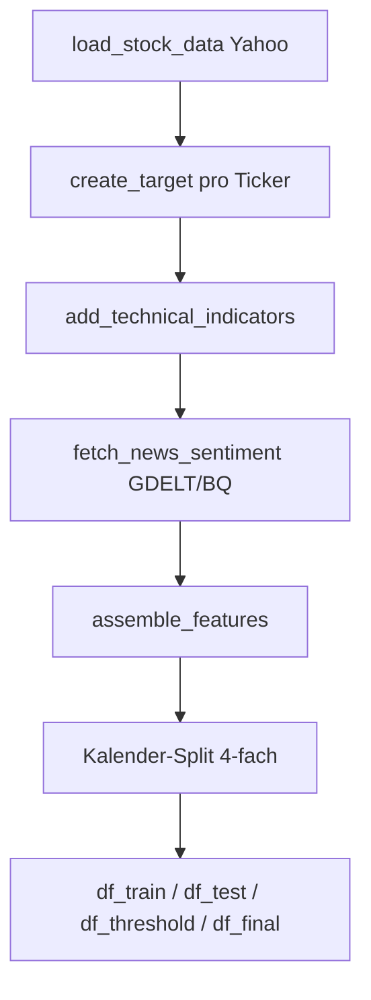
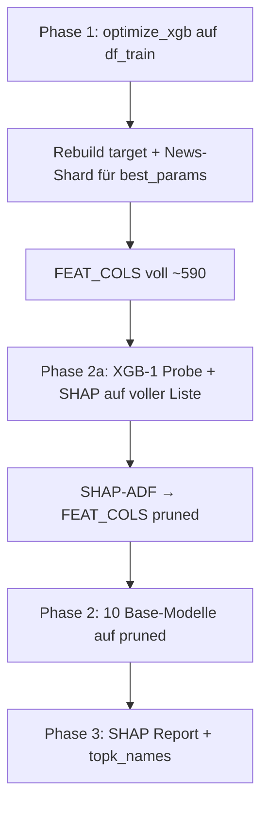
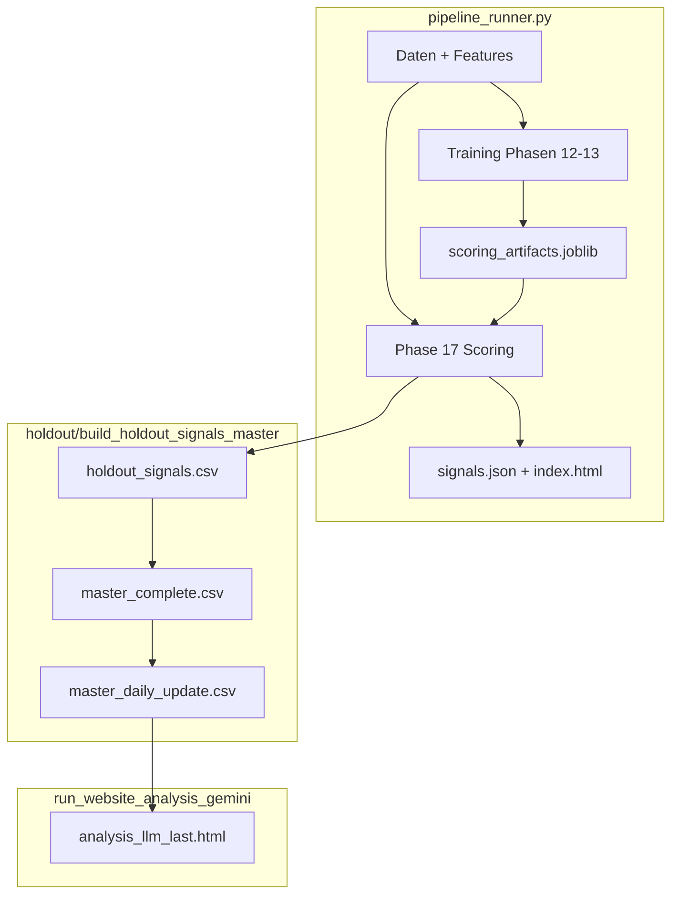

# stock_rally — Gesamtdokumentation

**Stand:** Juni 2026 · **Eine Datei** mit Pipeline-Übersicht, Systemreferenz, V11-Roadmap, Verbesserungsvorschlägen und SHAP-Anhang.

> Neu generieren: `python scripts/_gen_full_documentation_md.py`

---

## Gesamt-Inhaltsverzeichnis

| Teil | Inhalt | Abschnitte |
|------|--------|------------|
| **I** | Pipeline V10 (Phasen, Config, Signale, FAQ, **Verbesserungsvorschläge**, **OOS-Performance**, SHAP) | I.1 – I.18 |
| **II** | Systemreferenz (Architektur, Module, Rekonstruktion) | II.1 – II.16 |
| **III** | V11-Roadmap (Kritik, Arbeitspakete) | III.1 – III.7 |

Quellen (für Pflege): `docs/_pipeline_overview_static.md` (Teil I, §I.1–I.15), `docs/SYSTEM_REFERENZ.md` (Teil II), `docs/V11_ROADMAP.md` (Teil III). §I.16.3 Performance + §I.17 SHAP werden beim Build ergänzt.

---

# Teil I — Pipeline-Übersicht (V10)

## Inhaltsverzeichnis

1. [Glossar & Namensräume](#i1-glossar--namensräume)
2. [Einstieg: `pipeline_runner.py`](#i2-einstieg-pipeline_runnerpy)
3. [Konfiguration (`config_settings.py` → `config.py`)](#i3-konfiguration-config_settingspy--configpy)
4. [Schritt 0: Daten bis zum Kalender-Split](#i4-schritt-0-daten-bis-zum-kalender-split)
5. [Die vier Kalender-Fenster (Leakage-Schutz)](#i5-die-vier-kalender-fenster-leakage-schutz)
6. [Zielvariable `target` (Label)](#i6-zielvariable-target-label)
7. [Feature-Engineering (`FEAT_COLS`)](#i7-feature-engineering-feat_cols)
8. [Phase 12 — Base (Optuna, ADF, 10 Modelle)](#i8-phase-12--base-optuna-adf-10-modelle)
9. [Phase 13 — Meta-Learner & Phase 5 (Schwelle)](#i9-phase-13--meta-learner--phase-5-schwelle)
10. [Phasen 14–17 — Reports, Holdout, Website](#i10-phasen-1417--reports-holdout-website)
11. [Vom Modell zum Handelssignal](#i11-vom-modell-zum-handelssignal)
12. [Artefakte & Persistenz](#i12-artefakte--persistenz)
13. [Laufmodi-Matrix](#i13-laufmodi-matrix)
14. [FAQ / typische Missverständnisse](#i14-faq--typische-missverständnisse)
15. [Verbesserungsvorschläge (Holdout & Pipeline)](#i15-verbesserungsvorschläge-holdout--pipeline)
16. [OOS-Performance (Holdout)](#i16-oos-performance-holdout)
17. [Anhang: SHAP-Ranglisten](#i17-anhang-shap-ranglisten) *(dynamisch ergänzt)*

---

## I.1. Glossar & Namensräume

| Begriff | Bedeutung im Code |
|--------|-------------------|
| **`cfg` / `config`** | Ein gemeinsamer Python-Namespace: `from lib.stock_rally_v10 import config as cfg`. `config_settings.py` wird per `import *` eingebunden; Laufzeit-Variablen (DataFrames, Modelle) hängen als Attribute an `cfg`. |
| **`df_train`** | Zeilen des **BASE**-Kalenders (Phase 12: Optuna + Base-Modelle). |
| **`df_test`** | Zeilen des **META**-Kalenders (Phase 13: Meta-Learner). Historischer Name „test“ = Meta-Trainingsfenster, nicht FINAL-OOS. |
| **`df_threshold`** | Kalender nur für **Schwellen-Kalibrierung** (Phase 5 Grid auf THRESHOLD). |
| **`df_final`** | Echter **Out-of-Sample**-Kalender für Website/`signals.json`/Holdout-Plots. |
| **`FEAT_COLS`** | Liste der Spaltennamen, die Base-Modelle als Input nutzen (nach ADF: geprünte Liste). |
| **`FEAT_COLS_FULL`** | Volle Spaltenliste vor ADF (nur Phase 12 intern / Report). |
| **`topk_names`** | Roh-Features für Meta-Stack (35 Stück), aus Base-SHAP-Masse gewählt. |
| **`best_params`** | Dict der Base-Optuna-Gewinner (Fenster, News-Tag, XGB-Hyperparameter, Filter für Base-CV). |
| **`best_threshold`** | Produktive Wahrscheinlichkeitsschwelle auf Meta-`prob` (Phase 5 auf THRESHOLD). |
| **`prob`** | Spalte mit Meta-Wahrscheinlichkeit (ggf. kalibriert) pro Zeile. |

**Zeilenebene:** Jede Zeile = ein **Ticker an einem Handelstag** (nach Split). Es gibt keine „eine Zeile pro Tag für den ganzen Markt“, sondern Ticker × Datum.

---

## I.2. Einstieg: `pipeline_runner.py`

```text
bind_step_functions()          # Hängt Hilfsfunktionen an cfg (load_stock_data, create_target, …)
cfg.log_pipeline_mode_banner()
run_data_download_and_split()  # → cfg.df_train, df_test, df_threshold, df_final, …
run_training_scoring_and_export()  # Phasen 12–17
```

| Schritt | Modul | Output auf `cfg` |
|--------|--------|------------------|
| Daten | `data_and_split.run_data_download_and_split` | `df_features`, Split → `df_train`, `df_test`, `df_threshold`, `df_final` |
| Training | `training_phases.run_training_scoring_and_export` | Modelle, `best_threshold`, `FEAT_COLS`, Artefakt-Save |

**Wichtig:** Alles läuft über **`config_settings.py`** (importiert als `cfg`). Notebook-Variablen allein reichen nicht.

---

## I.3. Konfiguration (`config_settings.py` → `config.py`)

### 3.1 Laufmodus (entscheidend vor Start)

| Variable | Default (prüfen!) | Wirkung |
|----------|-------------------|--------|
| `SCORING_ONLY` | oft `True` im Repo | **Kein Training** — lädt Artefakt, macht Scoring/Website. Für ADF-Lauf: **`False`**. |
| `RETRAIN_META_ONLY` | `False` | `True` → Phase 12 übersprungen, Base aus `scoring_artifacts.joblib`. |
| `SKIP_META_OPTUNA` | `False` | Meta-Optuna überspringen, Checkpoint laden. |
| `SHAP_ADF_ENABLED` | `True` | ADF-Pipeline aktiv (siehe §8). |
| `SHAP_ADF_REPLACE_FEAT_COLS` | `True` | Nach ADF trainieren **alle** Base-Modelle auf geprüfter `FEAT_COLS`. |

### 3.2 Optuna & CV

| Variable | Typische Werte | Rolle |
|----------|----------------|------|
| `N_OPTUNA_TRIALS` | 150 | Base-Optuna-Trials (TPE). |
| `N_META_TRIALS` | 150 | Meta-Optuna-Trials. |
| `N_WF_SPLITS` | 5 | Walk-Forward-Folds in Base- und Meta-CV. |
| `OPTUNA_WF_SPLITS` | `None` → 5 | Optional weniger Base-Folds. |
| `OPT_MODEL_HYPERPARAMS` | `True` | Base-Optuna sucht XGB-`max_depth`, `learning_rate`, Focal-`gamma`, … |
| `OPT_OPTIMIZE_Y_TARGETS` | `False` | `True` würde Label-Parameter mit-suchen (teuer). |

### 3.3 Precision-Gates (Optimierungsziel)

| Variable | Wert | Wo |
|----------|------|-----|
| `OPT_MIN_PRECISION_BASE` | 0.64 | Base-Optuna CV: gefilterte Signale pro Fold |
| `OPT_MIN_PRECISION_META` | 0.99 | Meta-Optuna CV + Phase-5-Logik |
| `_OPT_MAX_CONSEC_FP` | 4 | Max. aufeinanderfolgende False Positives pro Ticker |

Base belohnt **Recall bei Precision ≥ 64 %**; Meta **strenger (99 %)**.

### 3.4 Kalender-Split (`SPLIT_MODE=time`)

| Variable | Default | Anteil der *Inhalts*-Handelstage |
|----------|---------|----------------------------------|
| `TIME_SPLIT_FRAC_BASE` | 0.45 | BASE |
| `TIME_SPLIT_FRAC_META` | 0.35 | META |
| `TIME_SPLIT_FRAC_THRESHOLD` | 0.05 | THRESHOLD |
| *(Rest)* | ~0.15 | FINAL |
| `TIME_PURGE_TRADING_DAYS` | 5 | Lücke **zwischen** jedem Block |

Purge-Tage sind **keine Trainingsdaten** — verhindern, dass Labels/Features am Blockrand leaken.

---

## I.4. Schritt 0: Daten bis zum Kalender-Split

Modul: `lib/stock_rally_v10/data_and_split.py` → `run_data_download_and_split()`.



### 4.1 Kurse (`load_stock_data`)

- Universum: `TICKERS_BY_SECTOR` (~285 Symbole), Download via `yfinance`.
- Zeitraum: `START_DATE` … `END_DATE` / `TRAIN_END_DATE`.
- Output: long format mit `Date`, `ticker`, OHLCV, ggf. Sektor-IDs.

### 4.2 Target (`create_target`)

- Ruft pro Ticker die **feste Band-Regel** auf (`FIXED_Y_*`, Modus `rally_plus_entry`), sofern `OPT_OPTIMIZE_Y_TARGETS=False`.
- Erzeugt Spalte **`target`** ∈ {0, 1} auf allen Zeilen **vor** dem Split (Target hängt nur vom Kursverlauf ab, nicht vom Split).

### 4.3 Technische Indikatoren (`add_technical_indicators`)

- Rolling Features: RSI, Bollinger, MACD, Vol-Stress, VCP, Blue-Sky, Drawdown, …
- Fenster sind **noch nicht** die Optuna-Gewinner — zunächst breite Berechnung für Cache.

### 4.4 News (`fetch_news_sentiment`)

- Quelle: `NEWS_SOURCE` (typisch BigQuery/GDELT).
- Ergebnis: `sentiment_df` / später Merge in `assemble_features`.
- Shards: `data/feature_shards_news/news_tag_*.parquet` (ein Parquet pro News-Parameter-Tripel).

### 4.5 Feature-Matrix (`assemble_features`)

- Join: Kurse + Indikatoren + News + Makro-Anreicherung (`augment_df_macro_regime_and_vol`).
- `cfg.FEAT_COLS` existiert nach Phase 12 final; vorher volles Raster aus `build_feature_cols`-Grids.
- Fehlende News: `FEATURE_NUMERIC_NAN_SENTINEL` (-1e8) + optional `news_missing`.

### 4.6 RETRAIN_META_ONLY vs. SCORING_ONLY beim Daten-Schritt

Wenn `RETRAIN_META_ONLY=True` **und** `SCORING_ONLY=False`, kann der News-/Feature-Build **leichtgewichtig** sein (`meta_only=True` in `assemble_features`) — volle News-Shards sind für Meta-Scoring dennoch nötig, wenn News-Features in `topk_names` stehen.

**Wichtig (Fix 2026-06):** Bei `SCORING_ONLY=True` wird `RETRAIN_META_ONLY` für `assemble_features` **ignoriert** (`meta_only_features_for_assemble` in `data_and_split.py`). Sonst fehlen News-Spalten im Live-Scoring → NaN/Sentinel `-1e8` → Meta-Probas kollabieren → nur noch ~45 statt ~480 Signale. Test: `tests/test_pipeline_invariants.py`.

---

## I.5. Die vier Kalender-Fenster (Leakage-Schutz)

Funktion: `_split_calendar_four_way` in `data_and_split.py`.

```text
Alle Handelstage ≤ TRAIN_END_DATE, sortiert:
[ BASE | purge | META | purge | THRESHOLD | purge | FINAL … ]
```

**Jeder Block** enthält **alle Ticker** × die Tage dieses Blocks (nicht unterschiedliche Ticker pro Phase im Zeit-Modus).

| DataFrame | Verwendung | Darf sehen |
|-----------|------------|------------|
| `df_train` | Base-Optuna, Base-Modelle, ADF-Probe | nur BASE-Tage |
| `df_test` | Meta-Optuna, Meta-Fit, Meta-SHAP | nur META-Tage |
| `df_threshold` | Phase-5 Threshold-Grid | nur THRESHOLD-Tage |
| `df_final` | Website, Holdout-Eval | nur FINAL-Tage |

**Warum getrennt?** Wenn Meta auf THRESHOLD trainieren würde, wäre die spätere Schwellenwahl auf demselben Kalender **in-sample** und optimistisch verzerrt.

Am Trainingsstart druckt `training_phases._log_training_partition_calendar` Min/Max-Datum und **Zeilenzahl** pro Block — dort siehst du die echte Meta-Größe (meist **viel mehr als 2000**).

---

## I.6. Zielvariable `target` (Label)

Aktuell: **`OPT_OPTIMIZE_Y_TARGETS = False`**, **`FIXED_Y_LABEL_MODE = rally_plus_entry`**.

### 6.1 Ökonomische Idee

Das Modell soll Tage markieren, an denen ein **Einstieg am nächsten Open** in ein **kurzes Rally-Fenster** (2–8 Handelstage, ≥ **4,5 %** kumulativ) plausibel ist — nicht „jeder grüne Tag“.

### 6.2 Wichtige Parameter

| Parameter | Wert | Rolle |
|-----------|------|------|
| `FIXED_Y_WINDOW_MIN/MAX` | 2 / 8 | Länge des Forward-Fensters |
| `FIXED_Y_RALLY_THRESHOLD` | 0.045 | Mindest-Rendite im Fenster |
| `FIXED_Y_RALLY_PLUS_TARGET_SEGMENT_HEAD_FRACTION` | 0.35 | Nur **Kopf** der Rally (erste 35 % der Rally-Tage) = positiv |
| `FIXED_Y_RALLY_SIGNAL_ENTRY_DAYS` | 2 | Zusätzliche Vorlauf-Tage vor dem Kopf |
| `FIXED_Y_MAX_DIP_BELOW_ENTRY_FRACTION` | 0.015 | Max. 1,5 % unter Entry-Open auf dem Pfad |

### 6.3 Base-Optuna und Labels

Bei `OPT_OPTIMIZE_Y_TARGETS=False` wird das Label **einmal** vor Optuna gebaut; Trials **rebuilden** das Target nicht (spart Zeit). Meta/Base teilen dieselbe Label-Definition über alle Splits hinweg (nur Kalender filtert Zeilen).

---

## I.7. Feature-Engineering (`FEAT_COLS`)

### 7.1 Wie Spalten entstehen

`cfg.build_feature_cols(rsi_w, bb_w, sma_w, news_mom_w, news_vol_ma, news_tone_roll, …)` in `config.py`:

1. **Technik** — `build_technical_cols`: Namen wie `rsi_21`, `bb_pband_20`, `yz_vol_60d`, …
2. **News** — `build_news_model_cols(tag)`: Hunderte Spalten pro News-Tag `mom_vol_tone` (z. B. `5_10_3` → `news_macro_5_10_3_tone`, GCAM-Themen, Lags, Z-Scores, Kreuzterme mit `mr_*`).
3. **Makro** — `append_macro_regime_vol_numeric_cols`: `mr_*`, `regime_*` (werden angehängt, nicht über RSI-Grid gesucht).

### 7.2 Optuna wählt **Fenster**, nicht einzelne Spalten

Pro Base-Trial wählt Optuna **ein Tripel** aus diskreten Grids (`config_settings.py`):

| Optuna-Parameter | Grid (Beispiel) |
|----------------|-----------------|
| `rsi_window` | 7, 10, 14, 21 |
| `bb_window` | 15, 20, 25 |
| `sma_window` | 30, 50, 70 |
| `news_mom_w` | 3, 5, 7 |
| `news_vol_ma` | 10, 20 |
| `news_tone_roll` | 3, 5, 10 |
| `yz_vol_window`, `adr_window`, … | je 2–3 Werte |

Daraus wird **ein** konsistentes `FEAT_COLS` für diesen Trial gebaut; XGB trainiert auf dieser Matrix.

### 7.3 Feature Pre-Screen (optional, vor Base-Optuna)

`FEATURE_PRESCREEN_ENABLED = True`:

- Läuft auf `df_train` (BASE).
- Walk-Forward + TreeSHAP + Boruta-Schatten → „Rauschboden“.
- Schreibt `data/feature_prescreen_v1.json`.
- Optuna nutzt `effective_window_grid('RSI_WINDOWS')` etc. — **eingeschränkte** Fenster, nicht einzelne Spalten-Subset pro Trial (außer News-Corr-Survivors).

### 7.4 News-Shards

- Pfad: `data/feature_shards_news/`.
- Pro News-Tag ein Parquet; Manifest `news_shards_manifest.json`.
- `NEWS_SHARDS_REUSE_SAME_CALENDAR_DAY=True`: max. ein Rebuild pro Tag.

### 7.5 FRED-Policy & Fear & Greed (`macro_vol_enrich.py`)

| Serie | FRED-ID | Spalten |
|-------|---------|---------|
| 10Y−2Y Spread | `T10Y2Y` | `mr_t10y2y`, `mr_t10y2y_ret1d/5d` |
| Fed-Bilanz | `WALCL` | `mr_walcl`, `mr_walcl_chg_5d/20d` (wöchentlich, ffill) |
| Fed Funds | `DFF`, `EFFR` | `mr_effr`, `mr_effr_ret1d/5d` |
| CNN Fear & Greed | CNN JSON-API | `mr_fear_greed`, `mr_fear_greed_ret5d`, `mr_fear_greed_z_20d` |

Config: `FRED_MACRO_POLICY_ENABLED`, `FEAR_GREED_ENABLED`, `FRED_API_KEY` in `.env`. Nach Code-Änderung: `MACRO_AUGMENT_CACHE_VERSION` erhöhen (aktuell **2**).

### 7.6 Phase 11 — Statistisches Pre-Pruning (V11, vor Optuna)

Modul: `training_phases/feature_pre_pruning.py` · läuft in `pipeline_runner` **nach** Split, **vor** Phase 12.

| Schritt | Regel |
|--------|--------|
| Daten | Nur **`df_train` (BASE)** — kein Leakage in META/THRESHOLD/FINAL |
| Sparsity | Drop Spalten mit ≥ `STATISTICAL_PRE_PRUNE_MAX_SENTINEL_FRAC` (Default 98 %) Sentinel/NaN |
| MI | `mutual_info_classif` vs. `target`, Top-`MI_TOP_K` (Default 150) |
| Whitelist | `mr_*`, `regime_*`, `sector_id`, … immer behalten |
| Optuna | `intersect_feat_cols_with_statistical_prune` — `news_*` pro Trial bleiben voll (eigenes Tag-Tripel) |

Konfiguration: `STATISTICAL_PRE_PRUNE_ENABLED`, Artefakt `data/statistical_pre_prune_v1.json`.

**News-Tag-Sync:** `news_tag_sync.sync_topk_for_meta` mappt gespeicherte `topk_names` auf `best_params`-News-Tag (behebt `3_20_10` vs `5_10_3` nach `RETRAIN_META_ONLY`).

---

## I.8. Phase 12 — Base (Optuna, ADF, 10 Modelle)

Modul: `training_phases/optuna_base_models.py`.



### 8.1 Phase 1 — `optimize_xgb` (`optuna_train.py`)

**Daten:** nur `df_train` (BASE).

**Pro Trial (vereinfacht):**

1. Wähle Fenster-Parameter + (optional) XGB-Hyperparameter + `consecutive_days`, `signal_cooldown_days`, `base_eval_threshold`.
2. Baue `feat_cols = build_feature_cols(...)`, merge News-Shard für gewähltes Tripel.
3. **Walk-Forward** (`N_WF_SPLITS` Folds) auf BASE-Kalender:
   - Train XGB mit Focal Loss, Early Stopping auf innerem Holdout.
   - **Nested threshold** auf innerem Kalibrier-Split (`_pick_threshold_nested_base`).
   - Val-Fold: wende Filter an (`_apply_filters_cv`) → Score `_score_tp_precision_fold`.
4. Mittel der Fold-Scores → Optuna maximiert.

**Filter in Base-CV** (aus `SEED_PARAMS`, nicht trial-variiert): Anti-Peak, RSI-Max, Vol-Stress, Blue-Sky, dynamischer Threshold-Multiplikator — aber **nicht** die Meta-Optuna-Parameter `signal_skip_near_peak` als Trial.

**Gewinner:** `cfg.base_optuna_best_params` / `best_params` in Phase 12.

### 8.2 Rebuild nach Optuna

- `rebuild_target_for_train` auf train/test/threshold/final (bei festem Y oft identisch).
- News-Shard für Gewinner-Tag mergen.
- `FEAT_COLS` final aus Gewinner-Fenstern (~590 Spalten typisch).

### 8.3 Phase 2a — SHAP-Probe & ADF (`SHAP_ADF_ENABLED`)

**Zweck:** Feature-Ranking auf **voller** Liste, dann Streichen toter Spalten **bevor** die 10 teuren Base-Modelle trainieren.

| Schritt | Detail |
|--------|--------|
| Train | Nur **ein** XGB-1 auf **vollem** `X_train_all` (BASE). |
| SHAP-Stichprobe | `min(2000, len(df_test))` Zeilen aus **META**-Kalender — nur für SHAP-Geschwindigkeit, **nicht** Meta-Training! |
| ADF | Drop Spalten mit mean \|SHAP\| < `SHAP_ADF_MIN_ABS_SHAP`; keep `mr_*`, `regime_*`, IDs; mindestens `SHAP_ADF_MIN_KEEP`. |
| Ergebnis | `FEAT_COLS` = geprünte Liste; `c.FEAT_COLS_PRUNED`, `FEAT_COLS_DROPPED`. |

### 8.4 Phase 2 — Zehn Base-Modelle (auf geprüfter `FEAT_COLS`)

| Modell | Training | Bemerkung |
|--------|----------|-----------|
| XGB-1…4 | `xgb.train`, Focal, Bootstrap-OOB-ES | Gleiche `xgb_base_params` aus Optuna |
| LGB-1…3 | LightGBM, Focal | |
| RF, ET | sklearn, 500 Bäume | |
| LR | Pipeline Imputer+Scaler+LogReg | braucht finite Werte |

**Input-Matrix:** `X_train_all = df_train[FEAT_COLS].values` — **alle BASE-Zeilen**, alle pruned Spalten.

**Output:** `cfg.base_models` — Liste von `(name, model, kind)`.

### 8.5 Phase 3 — SHAP, `topk_names`, Report

- **Finales** SHAP auf **trainiertem** XGB-1, Stichprobe wieder max. 2000 Zeilen aus `df_test`.
- `META_SHAP_CUM_FRAC` (0.85): kleinstes **K**, sodass Top-K-SHAP-Summe ≥ 85 % der Gesamt-SHAP auf **pruned** Pool.
- `topk_names` / `topk_idx`: Indizes in **`FEAT_COLS`** (pruned) für Meta-Roh-Features.
- Export: `models/base_feature_shap_report.json` (+ Spiegel `data/`).

---

## I.9. Phase 13 — Meta-Learner & Phase 5 (Schwelle)

Modul: `training_phases/meta_learner.py` → `run_phase_meta_learner_and_threshold`.

### 9.1 Meta-Features bauen

```python
# Konzeptuell (build_meta_features in Phase 13):
base_probs = [predict_base_m(X) for m in base_models]  # 10 Spalten
topk_raw     = X[:, topk_idx]                            # 35 Spalten
X_meta       = hstack(base_probs, topk_raw)              # 45 Features
```

**Base-Predict:** Jeder Base-Classifier sieht **`df[FEAT_COLS]`** (dieselbe pruned Liste wie beim Training).  
**Wichtig:** Meta nutzt Base-Outputs — Base und Meta-`FEAT_COLS` müssen aus **demselben** Phase-12-Lauf stammen.

### 9.2 Wie viele Zeilen trainiert Meta? (**nicht 2000**)

| Stufe | Datenmenge |
|-------|------------|
| Meta-Optuna CV | **Alle** Zeilen in `df_test` (META), aufgeteilt in WF-Folds |
| Finaler `meta_clf.fit` | **Alle** Zeilen: `meta_clf.fit(X_meta_test, y_test)` |
| Meta-SHAP | **Alle** `X_meta_test` |

Die **2000** erscheinen nur im **Base-SHAP-Report** (`shap_sample_rows`). Log-Zeile: `EARLY_TRAIN: (N, 45)` → **N = META-Zeilenanzahl**.

### 9.3 Meta-Optuna

- 150 Trials (oder `SKIP_META_OPTUNA` + Checkpoint).
- Pro Trial: Meta-XGB-Hyperparameter + **Filter-Parameter** (`signal_skip_near_peak`, `signal_max_rsi`, dynamische Mults, …).
- CV auf META mit gleicher Filterkette wie Produktion (`_apply_filters_cv`).
- Ziel (`META_OBJECTIVE_MODE=tp_precision`): Precision ≥ 99 %, TP-Recall-ähnlicher Score, max. 4 FP hintereinander.

### 9.4 Produktions-Fit

Nach Optuna:

```python
meta_clf.fit(X_meta_test, y_test)  # gesamtes META, kein Early-Stopping (kein eval_set)
```

Optional: `META_PROBA_CALIBRATION_METHOD = sigmoid` (Platt) — Kalibrierung vor Threshold.

### 9.5 Phase 5 — Threshold auf THRESHOLD (in derselben Datei)

**Nicht** Phase 15 — die produktive Schwelle kommt aus **Phase 13**:

1. Berechne `meta_prob` auf `df_threshold` (kalibriert).
2. Seed-Threshold: `nested_thr_mean` des besten Meta-Trials oder `meta_eval_threshold` (konfigurierbar).
3. Grid über ~19 Schwellen + Seed; pro Threshold: Filter + Objective (Precision/Coverage/Return je nach Modus).
4. Gewinner → `cfg.best_threshold` (ins Artefakt).

**Warum THRESHOLD?** Kalender, den Meta beim Training **noch nicht** „kennen“ musste für die Schwellenwahl.

### 9.6 Nach Phase 13

- `df_test`, `df_threshold`, `df_final` erhalten Spalte `prob`.
- `save_scoring_artifacts()` → `models/scoring_artifacts.joblib`.

---

## I.10. Phasen 14–17 — Reports, Holdout, Website

| Phase | Modul | Zweck |
|-------|--------|------|
| **14** | `regime.py` | Regime-/Benchmark-Report (Analyse, kein Training) |
| **15** | `threshold_pr_filters.py` | PR-Kurven, Filter-Diagnostik auf THRESHOLD/META — **ändert** `best_threshold` typisch nicht |
| **16** | `holdout.py` | Holdout-Plots vs. `target` |
| **17** | `daily_scoring_html.py` | `docs/signals.json`, `docs/index.html`, Charts; Signale aus **FINAL** (oder Override) |

### 10.1 Phase 17 — Ablauf & Ausgaben

1. **Scoring** auf `df_final` (Meta-Probas, Filterkette wie Training).
2. **Holdout-Master:** `build_holdout_signals_master()` → `data/holdout_signals.csv`, Anreicherung via `signal_extra_filters`.
3. **Website-Export:** JSON + HTML + PNG-Charts unter `docs/charts/`.
4. **Abschluss (aktuell):** `rebuild_master_from_signals_json()` — baut Master-CSV erneut aus `signals.json` (Yahoo-Download + Filter **zweites Mal**, ~10–15 min; siehe §15).

**Laufzeit `SCORING_ONLY`:** typisch **35–45 min** (nicht „nur HTML“): News-Gap-Fill (BigQuery/GDELT), volle Feature-Matrix, Meta-Scoring in Batches, doppelter Holdout-Rebuild, Chart-Generierung.

### 10.2 Kontext-Ampel (grün / gelb / rot)

**Module:** `lib/signal_context_tier.py` (Klassifikation), `lib/website_ampel_filter.py` (Filter-UI in `index.html`).

Die Ampel **filtert keine Signale aus dem Modell** — sie markiert OOS-Kontext für die Website und LLM-Spalten:

| Stufe | Bedingung | Anzeige |
|-------|-----------|---------|
| **Rot** | `macro_event_within_2bd = True` (FOMC/CPI/NFP ±2 Handelstage) | Makro-Risiko |
| **Grün** | kein Makro-Event **und** `regime_vix_level ≥ SIGNAL_CONTEXT_VIX_GREEN_MIN` (Default 20) | Erhöhtes Vol-Regime |
| **Gelb** | sonst | Standard |

Felder in `signals.json`: `context_tier`, `context_tier_label_de`, `context_tier_html`. Legacy-Keys (`red_summary_*`, `vix_regime_*`) werden beim Export entfernt.

### 10.3 Phase-17-Override & Hilfsskripte

| Mechanismus | Zweck |
|-------------|--------|
| `PHASE17_WEBSITE_SIGNALS_OVERRIDE` | Signalliste aus Datei/Git-Commit statt Live-Rescoring (Notfall-Wiederherstellung) |
| `_existing_chart_paths_on_disk()` | Vorhandene PNGs unter `docs/charts/` wiederverwenden (HTML-Regen ohne Neurender) |
| `scripts/regen_website_restore_good_signals.py` | Signale aus Git-Commit laden, Kontext-Tier anreichern, Charts/HTML |
| `scripts/regen_website_html_only.py` | Nur HTML aus bestehendem `signals.json` (~5 min) |
| `scripts/run_phase17_website_only.py` | Phase 17 isoliert (`SCORING_ONLY=True`, `RETRAIN_META_ONLY=False`) |

**Bugfix 2026-06:** Im Override-Pfad muss `COMPANY_NAMES = c.COMPANY_NAMES` gesetzt sein, sonst schlagen Chart-Slots fehl (`Charts 0 / N` in HTML).

---

## I.11. Vom Modell zum Handelssignal

```text
1. meta_prob = Meta.predict_proba(FEAT_COLS + base_probs + topk_raw)
2. raw_signal = meta_prob >= best_threshold
     → ggf. dynamisch: threshold × mult bei hohem VVIX/RSI/BB
3. apply_signal_filters (pro Ticker, chronologisch):
     - consecutive_days (z. B. 1–2)
     - signal_cooldown_days
     - anti-peak, max RSI, vol_stress, blue-sky volume
4. Export: nur FINAL-Kalender → signals.json / Website
```

**Training vs. Produktion:** Filter-Parameter stammen aus Meta-Optuna (`meta_study.best_params` → auf `cfg` geschrieben). Base-Optuna-Filter aus `SEED_PARAMS` beeinflussen nur **Base-CV-Score**, nicht direkt die exportierten Signale.

---

## I.12. Artefakte & Persistenz

`lib/scoring_persist.py` → `models/scoring_artifacts.joblib`:

| Key | Inhalt |
|-----|--------|
| `base_models` | 10 trainierte Modelle |
| `meta_clf` | Meta-XGB |
| `meta_proba_calibrator` | optional Platt/Isotonic |
| `best_threshold` | Phase-5-Gewinner |
| `FEAT_COLS` | **pruned** Liste (Base-Inference) |
| `FEAT_COLS_PRUNED` | gleich wie oben nach ADF |
| `topk_names`, `topk_idx` | Meta-Roh-Features |
| `best_params` | Base-Optuna-Gewinner (News-Tag, Fenster, …) |
| `meta_optuna_best_params` | Meta-Optuna |
| `base_feature_shap_report` | optional eingebettet |

**Nach erfolgreichem Lauf:** `SCORING_ONLY=True` möglich für tägliches Scoring ohne Retraining.

Weitere Dateien:

- `models/base_optuna_checkpoint.joblib` — Base-Optuna-Resume
- `models/meta_optuna_poststudy_checkpoint.json` — Meta-Optuna-Resume
- `data/feature_prescreen_v1.json` — Pre-Screen

---

## I.13. Laufmodi-Matrix

| Ziel | `SCORING_ONLY` | `RETRAIN_META_ONLY` | `SHAP_ADF` | Phase 12 | Phase 13 |
|------|----------------|---------------------|------------|----------|----------|
| Voller ADF-Lauf | **False** | False | True | läuft | läuft |
| Nur Meta (altes Artefakt, volle FEAT_COLS) | False | True | False | skip | läuft — **nur wenn Artefakt passt** |
| Nur Scoring/Website | True | *(ignoriert)* | — | skip | skip |
| Meta-Resume nach Crash | False | True/False | — | skip wenn Base da | True + `SKIP_META_OPTUNA` |

**Empfohlener ADF-Lauf:**

```python
SCORING_ONLY = False
RETRAIN_META_ONLY = False
SHAP_ADF_ENABLED = True
SHAP_ADF_REPLACE_FEAT_COLS = True
```

---

## I.14. FAQ / typische Missverständnisse

### „Meta trainiert nur auf 2000 Zeilen?“

**Nein.** 2000 = **Zufallsstichprobe nur für Base-SHAP** (`optuna_base_models.py`). Meta-Fit nutzt **komplettes** `df_test`. Im Log: `EARLY_TRAIN: (N, 45)`.

### „ADF und Base-Optuna — wer sucht Fenster?“

**Optuna** sucht RSI/BB/News-**Fenster** auf vollem Raster (ggf. Pre-Screen). **ADF** streicht danach **Spalten** mit toter SHAP-Masse; Base-Modelle trainieren auf der **kurzen** Liste.

### „Phase 15 wählt die Schwelle?“

**Nein.** Produktive `best_threshold` kommt aus **Phase 5 in `meta_learner.py`** (THRESHOLD-Kalender). Phase 15 ist Diagnose/Plots.

### „`df_test` ist Testset?“

Historischer Name. **`df_test` = META-Trainingskalender.** Echter OOS-Test = **`df_final`**.

### „News-Tag 3_20_10 vs 5_10_3?“

`best_params` / Artefakt speichern den News-Tag des **letzten** Phase-12-Laufs. Meta-Roh-Spalten in `topk_names` müssen in `df_test` existieren — sonst NaN/Sentinel. Nach ADF-Lauf: ein gemeinsamer Lauf Phase 12+13.

### „Warum LR im Meta-Stack wenn SHAP ≈ 0?“

Meta-Stack enthält immer alle 10 Probas; SHAP zeigt, dass Meta sie kaum nutzt — Modell bleibt trotzdem im Ensemble.

### „SCORING_ONLY liefert plötzlich nur ~45 Signale?“

Häufige Ursachen: (1) `RETRAIN_META_ONLY=True` zusammen mit `SCORING_ONLY` **vor** dem Fix in §4.6 — volle Feature-Matrix fehlte; (2) Live-Rescoring mit NaN in `FEAT_COLS` → Sentinel `-1e8`; (3) falscher News-Tag vs. Artefakt. Gegenprobe: Signalanzahl in Logs vs. `len(signals.json["signals"])`.

### „BigQuery lädt nur einen fehlenden Tag (z. B. Freitag), obwohl heute Sonntag ist?“

News-Gaps nutzen **`pd.bdate_range`** (Handelstage). Wenn der Cache bis Freitag reicht, fehlt nur der nächste Werktag — Wochenenden werden übersprungen. `END_DATE` kann trotzdem Kalendertag „heute“ sein.

### „Pipeline fühlt sich wie eine Endlosschleife an?“

Linear, aber wiederholte Logs: Meta-Scoring (18×8 Modelle), joblib-Worker (`Configuration loaded` mehrfach), **doppelter** Holdout-Rebuild am Ende von Phase 17. Kein Deadlock — siehe §10.1.

---

## I.15. Verbesserungsvorschläge (Holdout & Pipeline)

*Stand: Juni 2026 — aus Code-Review, OOS-Diagnostik und Laufzeit-Analyse. Priorisiert nach erwartetem Nutzen vs. Aufwand. Details in `STOCK_RALLY_DOKUMENTATION.md` (Teil III).*

### Stufe A — Pipeline-Robustheit & schnelle Wins

| # | Thema | Problem | Vorschlag |
|---|--------|---------|-----------|
| A1 | **Doppelter Holdout-Rebuild** | Phase 17 ruft `build_holdout_signals_master` und danach `rebuild_master_from_signals_json` mit gleicher Signalliste auf | Ein Pfad: Master einmal bauen oder Rebuild nur wenn JSON sich geändert hat |
| A2 | **Live-Scoring NaN-Guard** | Fehlende `FEAT_COLS` → `-1e8` → kollabierte Probas | Harte Validierung vor Meta-Predict: fehlende Spalten abbrechen/warnen, nicht silent sentinel |
| A3 | **News-Tag-Härtung** | `best_params`-Tag vs. `topk_names` / Shards | `NEWS_TAG` ins Artefakt + Assert beim Load (teilweise via `news_tag_sync`) |
| A4 | **Earnings-Kalender** | `next_earnings_date` in Holdout/LLM ~100 % leer (yfinance unzuverlässig) | Externer Kalender (NASDAQ/FMP) in `signal_extra_filters` |
| A5 | **SCORING_ONLY-Erwartung** | Nutzer erwarten Minuten-Lauf | Banner/Log: geschätzte Dauer + welche Schritte laufen |

### Stufe B — Modell & Signalqualität

| # | Thema | Problem | Vorschlag |
|---|--------|---------|-----------|
| B1 | **Cross-Section-Features** | siehe **Top-Priorität #1** — `macro_event_within_2bd`, `ret_vs_spy_*` nur post-hoc in Holdout | In `assemble_features` + `FEAT_COLS`, dann Meta-Retrain |
| B2 | **ATR-Target** | siehe **Top-Priorität #2** — feste 4,5 %-Schwelle volatilitätsverzerrt | Neuer Label-Modus + voller Retrain-Reset |
| B3 | **Objective vs. Rendite** | `META_OBJECTIVE_MODE=tp_precision` optimiert Klassifikation, nicht Forward-Return | Joint Objective auf THRESHOLD (siehe V11 §1) |
| B4 | **Threshold-Trennung** | Meta-Fit auf META, Schwelle auf THRESHOLD — bewusst, aber suboptimal | Nested Threshold pro CV-Fold oder gemeinsame Optuna |
| B5 | **Kontext-Ampel → Aktion** | Rot/Gelb nur UI (OOS-Daten in §16 belegen Makro-Risiko) | Optional: Positionsgröße / Warnung; Modell-seitig via #1 |
| B6 | **Ticker-News** | Nur GDELT Makro/Sektor | GDELT- oder Finnhub-Ticker-Sentiment als Feature-Shard |

### Stufe C — Daten & Architektur (V11+)

| # | Thema | Vorschlag |
|---|--------|-----------|
| C1 | Options-IV / Put-Call | CBOE oder Polygon als Regime-Feature |
| C2 | Fundamentals | Quarterly Snapshots (Margin, Rev-Growth) point-in-time |
| C3 | CFTC CoT | Positionierung Commodities/FX |
| C4 | Fear & Greed | CNN-Scraper robuster machen oder Alternative |
| C5 | End-to-End-Optimierung | Ein Kalender, ein Objective — `STOCK_RALLY_DOKUMENTATION.md` (Teil III) §1 |

### Bekannte technische Schulden

- Notebook-Zelle 17 und `pipeline_runner.py` Phase 17 teilen Logik — Doku und Entry-Points parallel pflegen.
- `scripts/_scratch_*.py` sind experimentell, nicht Teil der produktiven Pipeline.
- Website-Charts als Base64 in HTML → große `index.html`; externe PNG-Pfade sind robuster (teilweise umgesetzt).

---

## I.16. OOS-Performance (Holdout)

Nach **Phase 17** / `build_holdout_signals_master` werden pro Lauf **Forward-Renditen** und Aggregat-Kennzahlen persistiert. Maßgeblich für „funktioniert das Modell wirtschaftlich?“ ist der **FINAL**-Kalender (OOS), nicht META-CV oder THRESHOLD.

### 16.1 Gespeicherte Run-Artefakte

| Pfad | Inhalt |
|------|--------|
| `data/master_complete.csv` | **Primärquelle:** alle OOS-Signale × Meta-Spalten × `ret_2d`…`ret_10d` × `ret_mean_5` × LLM-Zusatzspalten |
| `data/master_daily_update.csv` | Nur **neuester Signaltag** (schlanke LLM-Spalten, keine Forward-Historie) |
| `data/holdout_oos_performance.json` | **Aggregat-Summary** (Mittel, Win-Rate, Kontext-Segmente, Jahre) — wird am Ende von `build_holdout_signals_master` geschrieben |
| `docs/signals.json` | OOS-Signalliste, `threshold`, `generated` (Zeitstempel Lauf) |
| `models/scoring_artifacts.joblib` | `best_threshold`, `meta_optuna_best_value`, Kalender-Ende Threshold-Kalibrierung |
| `data/model_snapshots/` | Optional manuell (`scripts/save_pre_optimization_snapshot.py`, `create_post_snapshot_and_compare.py`) |

**Timing-Logik Forward-Renditen:** Einstieg am **nächsten Handelstag-Open** nach Signaltag; Horizonte 2/4/6/8/10 Handelstage (`holdout/build_holdout_signals_master.py`). `ret_mean_5` = Mittel der fünf Horizont-Renditen (nur wenn alle fünf endlich).

### 16.2 Kennzahlen lesen

| Metrik | Bedeutung |
|--------|-----------|
| `ret_mean_5` | **Haupt-KPI** für OOS-Rendite (Mittel über 5 Horizonte) |
| `ret_4d` / `ret_10d` | Einzelhorizonte (Meta-Optuna nutzt ggf. andere Horizonte — siehe `META_SIGNAL_RETURN_HORIZONS`) |
| Win-Rate | Anteil Signale mit Rendite > 0 |
| `train_target=1` | Label-Treffer im Holdout-Export (**nicht** identisch mit Forward-Return — Legacy-Band-Label) |
| Kontext-Segmente | `macro_event_within_2bd`, `regime_vix_level` — Ampel-Diagnostik (§10.2); **Rot ~38,5 % Win-Rate** → siehe §15 Top-Priorität #1 |

**Wichtig:** Signale der **letzten ~10 Handelstage** haben oft noch **kein** `ret_mean_5` (Forward-Fenster unvollständig) — deshalb `n_signals_total` > `n_signals_with_ret_mean_5`.

### 16.3 Aktueller Stand (automatisch aus letztem Lauf)

*Der folgende Block wird beim Build aus `data/holdout_oos_performance.json` bzw. `master_complete.csv` ergänzt (`python scripts/_gen_pipeline_overview_md.py`).*

<!-- PERFORMANCE_SNAPSHOT_START -->
**Stand:** `2026-06-14T18:55:27.431251+00:00` · Quelle: `data/master_complete.csv` · Signale: **478** (davon **467** mit `ret_mean_5`)

Website-Lauf: `2026-06-14 20:33` · Schwelle: `0.9`
Artefakt: `best_threshold=0.9` · Meta-Optuna-Score=`106.0` · Kalibrier-Ende=`2024-10-14`

| Horizont | n | Mittel | Median | Win-Rate |
|----------|---|--------|--------|----------|
| `ret_mean_5` | 467 | 1.4312% | 1.2264% | 57.6% |
| `ret_2d` | 467 | 0.2478% | 0.012% | 50.75% |
| `ret_4d` | 467 | 1.1251% | 0.7143% | 54.6% |
| `ret_6d` | 467 | 1.3584% | 0.9187% | 54.6% |
| `ret_8d` | 467 | 1.7729% | 1.094% | 56.32% |
| `ret_10d` | 467 | 2.6517% | 1.8405% | 59.96% |

### Kontext-Ampel (ret_mean_5)

| Segment | n | Mittel | Win-Rate |
|---------|---|--------|----------|
| Rot (Makro-Event ±2bd) | 109 | -1.7463% | 38.53% |
| Gelb/Grün (kein Makro-Event) | 358 | 2.3986% | 63.41% |
| Grün (VIX ≥ 20) | 148 | 2.4758% | 68.92% |
| Gelb (VIX < 20) | 319 | 0.9466% | 52.35% |

### Nach Jahr

| Jahr | n | Mittel ret_mean_5 | Win-Rate |
|------|---|-----------------|----------|
| 2024 | 36 | -0.9574% | 36.11% |
| 2025 | 274 | 1.0384% | 58.39% |
| 2026 | 157 | 2.6644% | 61.15% |

*Neuere Signale ohne vollständiges Forward-Fenster fehlen in `ret_mean_5` (typisch die letzten ~10 Handelstage).*


---

## I.17. Anhang: SHAP-Ranglisten

*Der folgende Abschnitt wird beim Build aus den JSON-Reports ergänzt (`python scripts/_gen_pipeline_overview_md.py`).*

<!-- SHAP_APPENDIX_START -->

**Stand Base-SHAP:** `2026-06-05T21:17:18.789277+00:00` · **Base-Features (Report):** 274 · **Modell:** XGB-1 auf 2000 Zeilen (df_test (META calendar)) · **Meta-SHAP:** 43 Inputs

### 17.1 Base-Optuna-Gewinner (aus SHAP-Report)

| Parameter | Wert |
|-----------|------|
| `rsi_w` | 21 |
| `bb_w` | 25 |
| `sma_w` | 70 |
| News-Tag (Spaltenpräfix) | `5_10_3` |
| `topk_k` | 35 |
| `META_SHAP_CUM_FRAC` | 0.85 |
| Kum. SHAP-Masse Top-K | 70.8 % |
| Features mit \|SHAP\| ≈ 0 | 38 |


### SHAP-ADF (letzter Lauf)

| Kennzahl | Wert |
|----------|------|
| Aktiv | `True` |
| Features vor ADF | ? |
| Features nach ADF | ? |
| Gedroppt | ? |
| Min. mean \|SHAP\| | 1e-06 |
| Min. Keep | 80 |


### 17.2 `topk_names_raw` (Meta-Roh-Features, Reihenfolge)

1. `adr_pct_20d`
2. `rsi_delta_3d_21`
3. `downside_vol_120d`
4. `yz_vol_20d`
5. `mr_vvix_div_vix`
6. `mr_walcl_chg_20d`
7. `mr_rvx_level`
8. `sma200_delta_5d`
9. `mr_walcl`
10. `mr_effr`
11. `mr_dxy_level`
12. `news_macro_7_10_10_tone_x_sign_ret_1d`
13. `news_macro_7_10_10_tone_x_mr_vvix_div_vix`
14. `mr_vxn_level`
15. `vcp_tightness_slope_10_60d`
16. `bb_delta_3d_25`
17. `btc_momentum`
18. `regime_tnx_ret_5d`
19. `mr_t10y2y`
20. `close_vs_sma200`
21. `news_sec_7_10_10_gcam_c12_1_tone_mom`
22. `sector_avg_rsi_21`
23. `mr_dxy_mom_20d`
24. `mr_dxy_mom_60d`
25. `vol_ratio`
26. `month`
27. `news_macro_7_10_10_vol_l5`
28. `news_macro_7_10_10_tone_x_sign_ret_lag1`
29. `mr_rvx_div_vix`
30. `news_macro_7_10_10_tone`
31. `news_macro_7_10_10_tone_l3`
32. `news_macro_7_10_10_vol_l3`
33. `news_macro_7_10_10_tone_mom`
34. `news_sec_7_10_10_gcam_c16_57_tone_x_log1p_artcount`
35. `mr_effr_ret5d`

### 17.3 Top 100 Base-SHAP

**Quelle:** `models/base_feature_shap_report.json` · **Metrik:** mean |SHAP| · **Modell:** XGB-1 nach Phase 12 (finale SHAP auf geprüfter Liste).

| Rank | mean \|SHAP\| | Anzeigename | Raw-Spalte |
|------|-------------|-------------|------------|
| 1 | 0.104709 | Yang-Zhang Vol 60d | `yz_vol_60d` |
| 2 | 0.096923 | ADR Proxy 10d | `adr_pct_10d` |
| 3 | 0.091439 | RSI Δ3d (21d) | `rsi_delta_3d_21` |
| 4 | 0.048721 | SMA200 Ratio Δ 5d | `sma200_delta_5d` |
| 5 | 0.035371 | BB Δ3d (20d) | `bb_delta_3d_20` |
| 6 | 0.034881 | news macro 5 10 3 tone x mr vvix div vix | `news_macro_5_10_3_tone_x_mr_vvix_div_vix` |
| 7 | 0.028505 | mr_vvix_div_vix | `mr_vvix_div_vix` |
| 8 | 0.024273 | mr_rvx_level | `mr_rvx_level` |
| 9 | 0.022855 | Downside Vol 60d | `downside_vol_60d` |
| 10 | 0.022031 | mr_dxy_level | `mr_dxy_level` |
| 11 | 0.021946 | mr_vvix_level_ret1d | `mr_vvix_level_ret1d` |
| 12 | 0.016775 | regime_spy_realvol_5d_ann | `regime_spy_realvol_5d_ann` |
| 13 | 0.016552 | mr_dxy_mom_60d | `mr_dxy_mom_60d` |
| 14 | 0.016225 | mr_dxy_mom_20d | `mr_dxy_mom_20d` |
| 15 | 0.013069 | regime_tnx_ret_5d | `regime_tnx_ret_5d` |
| 16 | 0.011332 | BB Slope 5d (20d) | `bb_slope_5d_20` |
| 17 | 0.011286 | Breadth (SMA70) | `market_breadth_70` |
| 18 | 0.010498 | Bollinger %B (20d) | `bb_pband_20` |
| 19 | 0.010482 | Close / SMA200 | `close_vs_sma200` |
| 20 | 0.009842 | news macro 5 10 3 vol l5 | `news_macro_5_10_3_vol_l5` |
| 21 | 0.009420 | news macro 5 10 3 tone z w20 | `news_macro_5_10_3_tone_z_w20` |
| 22 | 0.008954 | BTC Mom Z roll120 | `btc_momentum_z_w120` |
| 23 | 0.008894 | news macro 5 10 3 vol l3 | `news_macro_5_10_3_vol_l3` |
| 24 | 0.008384 | BB Squeeze Factor (20d) | `bb_squeeze_factor_20` |
| 25 | 0.007947 | mr_vxn_level | `mr_vxn_level` |
| 26 | 0.007478 | Momentum Accel | `momentum_accel` |
| 27 | 0.007229 | regime_vix_z_20d | `regime_vix_z_20d` |
| 28 | 0.007226 | news sec 5 10 3 gcam c16 57 tone x log1p artcount | `news_sec_5_10_3_gcam_c16_57_tone_x_log1p_artcount` |
| 29 | 0.006770 | news macro 5 10 3 tone x regime vix level | `news_macro_5_10_3_tone_x_regime_vix_level` |
| 30 | 0.006122 | Rel. Mom 20d vs sector | `rel_momentum_20d` |
| 31 | 0.006007 | news macro 5 10 3 vol l1 | `news_macro_5_10_3_vol_l1` |
| 32 | 0.005939 | BTC Momentum | `btc_momentum` |
| 33 | 0.005213 | mr_vix3m_div_vix | `mr_vix3m_div_vix` |
| 34 | 0.004988 | BB(20) × RSI(21) | `bb_x_rsi_20_21` |
| 35 | 0.004772 | news sec 5 10 3 gcam c2 76 tone x log1p artcount | `news_sec_5_10_3_gcam_c2_76_tone_x_log1p_artcount` |
| 36 | 0.004171 | news macro 5 10 3 tone mom | `news_macro_5_10_3_tone_mom` |
| 37 | 0.004144 | news sec 5 10 3 gcam c18 158 tone | `news_sec_5_10_3_gcam_c18_158_tone` |
| 38 | 0.004069 | mr_rvx_div_vix | `mr_rvx_div_vix` |
| 39 | 0.003904 | Month | `month` |
| 40 | 0.003777 | mr_vvix_level | `mr_vvix_level` |
| 41 | 0.003624 | Breadth Z SMA70 roll60 | `market_breadth_z_70_w60` |
| 42 | 0.003494 | news macro 5 10 3 tone z w20 dz1 | `news_macro_5_10_3_tone_z_w20_dz1` |
| 43 | 0.003464 | Drawdown 252d | `drawdown_252d` |
| 44 | 0.003201 | news sec 5 10 3 gcam c18 159 tone x log1p artcount | `news_sec_5_10_3_gcam_c18_159_tone_x_log1p_artcount` |
| 45 | 0.003154 | mr_vvix_level_ret5d | `mr_vvix_level_ret5d` |
| 46 | 0.003113 | news macro 5 10 3 vol z w20 | `news_macro_5_10_3_vol_z_w20` |
| 47 | 0.002993 | mr_spyrv_points_div_vix | `mr_spyrv_points_div_vix` |
| 48 | 0.002603 | mr_vix_level_ret1d | `mr_vix_level_ret1d` |
| 49 | 0.002508 | news sec 5 10 3 gcam c18 159 tone | `news_sec_5_10_3_gcam_c18_159_tone` |
| 50 | 0.002408 | news sec 5 10 3 gcam c18 161 tone x log1p artcount | `news_sec_5_10_3_gcam_c18_161_tone_x_log1p_artcount` |
| 51 | 0.002368 | mr_vxv_div_vix | `mr_vxv_div_vix` |
| 52 | 0.002233 | mr_vxv_level | `mr_vxv_level` |
| 53 | 0.002209 | news sec 5 10 3 gcam c18 158 tone x log1p artcount | `news_sec_5_10_3_gcam_c18_158_tone_x_log1p_artcount` |
| 54 | 0.002206 | news macro 5 10 3 tone l5 | `news_macro_5_10_3_tone_l5` |
| 55 | 0.002153 | RSI Weekly (21d) | `rsi_weekly_21` |
| 56 | 0.002106 | news sec 5 10 3 tone x log1p artcount | `news_sec_5_10_3_tone_x_log1p_artcount` |
| 57 | 0.002104 | news macro 5 10 3 tone l1 | `news_macro_5_10_3_tone_l1` |
| 58 | 0.002081 | Sector ID (Research-Cluster) | `sector_id` |
| 59 | 0.001972 | mr_vvix_vix_ret1d_spread | `mr_vvix_vix_ret1d_spread` |
| 60 | 0.001937 | regime_vix_level | `regime_vix_level` |
| 61 | 0.001871 | news macro 5 10 3 vol spike | `news_macro_5_10_3_vol_spike` |
| 62 | 0.001819 | mr_vvix_vix_ret5d_spread | `mr_vvix_vix_ret5d_spread` |
| 63 | 0.001763 | news macro 5 10 3 tone l3 | `news_macro_5_10_3_tone_l3` |
| 64 | 0.001740 | mr_momentum20_div_spyrv | `mr_momentum20_div_spyrv` |
| 65 | 0.001717 | Dist to Prior High 60d | `dist_to_prior_hi_pct_60d` |
| 66 | 0.001704 | news sec 5 10 3 gcam c18 158 tone d1 | `news_sec_5_10_3_gcam_c18_158_tone_d1` |
| 67 | 0.001600 | news sec 5 10 3 gcam c18 161 tone l5 | `news_sec_5_10_3_gcam_c18_161_tone_l5` |
| 68 | 0.001596 | news sec 5 10 3 gcam c18 158 tone z w20 shock | `news_sec_5_10_3_gcam_c18_158_tone_z_w20_shock` |
| 69 | 0.001531 | news macro 5 10 3 vol | `news_macro_5_10_3_vol` |
| 70 | 0.001381 | mr_vix_level_ret5d | `mr_vix_level_ret5d` |
| 71 | 0.001367 | news macro 5 10 3 tone | `news_macro_5_10_3_tone` |
| 72 | 0.001332 | news sec 5 10 3 gcam c18 159 tone l3 | `news_sec_5_10_3_gcam_c18_159_tone_l3` |
| 73 | 0.001291 | news macro 5 10 3 tone d1 | `news_macro_5_10_3_tone_d1` |
| 74 | 0.001166 | news sec 5 10 3 gcam c16 57 tone l5 | `news_sec_5_10_3_gcam_c16_57_tone_l5` |
| 75 | 0.001152 | news sec 5 10 3 tone l3 | `news_sec_5_10_3_tone_l3` |
| 76 | 0.001148 | news sec 5 10 3 gcam c18 161 tone l3 | `news_sec_5_10_3_gcam_c18_161_tone_l3` |
| 77 | 0.001094 | news sec 5 10 3 gcam c18 158 tone l5 | `news_sec_5_10_3_gcam_c18_158_tone_l5` |
| 78 | 0.001062 | VCP Tightness HL 10d | `vcp_tightness_hl_10d` |
| 79 | 0.001049 | news sec 5 10 3 gcam c18 161 tone | `news_sec_5_10_3_gcam_c18_161_tone` |
| 80 | 0.001041 | RSI (21d) | `rsi_21` |
| 81 | 0.001033 | ADX | `adx` |
| 82 | 0.000984 | news sec 5 10 3 gcam c16 57 tone l3 | `news_sec_5_10_3_gcam_c16_57_tone_l3` |
| 83 | 0.000964 | news macro 5 10 3 tone z w20 x volz pos | `news_macro_5_10_3_tone_z_w20_x_volz_pos` |
| 84 | 0.000918 | news sec 5 10 3 tone z w20 | `news_sec_5_10_3_tone_z_w20` |
| 85 | 0.000913 | news sec 5 10 3 gcam c12 1 tone l5 | `news_sec_5_10_3_gcam_c12_1_tone_l5` |
| 86 | 0.000831 | news sec 5 10 3 gcam c16 57 tone z w20 shock | `news_sec_5_10_3_gcam_c16_57_tone_z_w20_shock` |
| 87 | 0.000813 | news sec 5 10 3 vol | `news_sec_5_10_3_vol` |
| 88 | 0.000773 | news macro 5 10 3 tone x log1p artcount | `news_macro_5_10_3_tone_x_log1p_artcount` |
| 89 | 0.000766 | Corr Stock/BTC 20d | `corr_stock_btc_20d` |
| 90 | 0.000758 | news sec 5 10 3 gcam c18 158 vol | `news_sec_5_10_3_gcam_c18_158_vol` |
| 91 | 0.000722 | Volume Z-Score | `volume_zscore` |
| 92 | 0.000720 | news sec 5 10 3 gcam c18 158 tone z w20 x volz pos | `news_sec_5_10_3_gcam_c18_158_tone_z_w20_x_volz_pos` |
| 93 | 0.000699 | news sec 5 10 3 gcam c16 57 tone | `news_sec_5_10_3_gcam_c16_57_tone` |
| 94 | 0.000679 | news macro 5 10 3 tone z w20 shock | `news_macro_5_10_3_tone_z_w20_shock` |
| 95 | 0.000672 | mr_vxn_div_vix | `mr_vxn_div_vix` |
| 96 | 0.000622 | Vol Ratio 5/20d | `vol_ratio` |
| 97 | 0.000613 | news sec 5 10 3 vol l1 | `news_sec_5_10_3_vol_l1` |
| 98 | 0.000612 | VCP Tightness 10d | `vcp_tightness_10d` |
| 99 | 0.000598 | Amihud Illiquidity 10d | `amihud_illiquidity_10d` |
| 100 | 0.000592 | news sec 5 10 3 anchor gcam c12 1 tone x log1p artcount | `news_sec_5_10_3_anchor_gcam_c12_1_tone_x_log1p_artcount` |

**Lesart:** In den Top 20 dominieren Volatilität/ADR/RSI-Delta, Makro-Vol-Regime (`mr_*`, `regime_*`) und News×Makro-Kreuzterme.

### 17.4 Meta-Learner SHAP (Phase 13)

**Quelle:** `data/meta_feature_shap_report.json` · **Metrik:** mean |SHAP| auf **gesamtem META** (`df_test`) ·
**Modell:** Meta-XGB nach Optuna + finalem Fit.

| Kennzahl | Wert |
|----------|------|
| Meta-Inputs gesamt | 43 |
| Davon Base-`prob` | 8 |
| Davon Roh-Features (Top-K) | 35 |
| Summe mean \|SHAP\| Base-`prob` | 0.6901 (47.7 % der Gesamtmasse) |
| Summe mean \|SHAP\| Roh-Features | 0.7561 (52.3 % der Gesamtmasse) |
| Features mit \|SHAP\| ≈ 0 | 5 |

#### Lesart

- Der Meta-Classifier **gewichtet vor allem die Base-Ensemble-Probas** — typisch **LGB-3**, **RF**, **XGB-2/4**.
- Roh-Features: BTC-Momentum-Z, News-Makro-Tone, RVX/DXY, Zinsregime.
- **XGB-1_prob** / **LR_prob** oft nahe 0 SHAP — Meta bevorzugt andere Basen.
- Meta-Roh-News-Präfix: **`7_10_10`** — muss mit Phase-12-News-Tag in `best_params` übereinstimmen.

#### Vollständige Rangliste (alle 43 Meta-Features)

| Rank | mean \|SHAP\| | Typ | Feature |
|------|-------------|-----|---------|
| 1 | 0.172728 | Base-`prob` | `LGB-3_prob` |
| 2 | 0.126707 | Base-`prob` | `RF_prob` |
| 3 | 0.111944 | Base-`prob` | `XGB-2_prob` |
| 4 | 0.082686 | Base-`prob` | `XGB-4_prob` |
| 5 | 0.073817 | Base-`prob` | `LGB-2_prob` |
| 6 | 0.067782 | Roh (Top-K) | `btc_momentum_z_w120` |
| 7 | 0.059758 | Roh (Top-K) | `news_macro_3_20_10_tone_z_w30` |
| 8 | 0.058404 | Roh (Top-K) | `mr_rvx_div_vix` |
| 9 | 0.055840 | Roh (Top-K) | `mr_rvx_level` |
| 10 | 0.054990 | Base-`prob` | `XGB-3_prob` |
| 11 | 0.049879 | Base-`prob` | `LGB-1_prob` |
| 12 | 0.049869 | Roh (Top-K) | `bb_pband_15` |
| 13 | 0.044853 | Roh (Top-K) | `news_macro_3_20_10_tone_x_log1p_artcount` |
| 14 | 0.042002 | Roh (Top-K) | `regime_tnx_ret_5d` |
| 15 | 0.037412 | Roh (Top-K) | `rsi_delta_3d_21` |
| 16 | 0.035100 | Roh (Top-K) | `adr_pct_10d` |
| 17 | 0.034705 | Roh (Top-K) | `mr_dxy_mom_60d` |
| 18 | 0.030749 | Roh (Top-K) | `mr_dxy_level` |
| 19 | 0.030221 | Roh (Top-K) | `yz_vol_60d` |
| 20 | 0.027743 | Base-`prob` | `ET_prob` |
| 21 | 0.026192 | Roh (Top-K) | `mr_vxn_level` |
| 22 | 0.022370 | Roh (Top-K) | `mr_dxy_mom_20d` |
| 23 | 0.021427 | Roh (Top-K) | `mr_vvix_div_vix` |
| 24 | 0.019765 | Roh (Top-K) | `news_macro_3_20_10_tone_l5` |
| 25 | 0.018890 | Roh (Top-K) | `news_sec_3_20_10_gcam_c18_161_tone_z_w30` |
| 26 | 0.017739 | Roh (Top-K) | `news_sec_3_20_10_gcam_c12_1_tone_z_w30` |
| 27 | 0.015941 | Roh (Top-K) | `sma200_delta_5d` |
| 28 | 0.015035 | Roh (Top-K) | `news_macro_3_20_10_vol_l5` |
| 29 | 0.014341 | Base-`prob` | `XGB-1_prob` |
| 30 | 0.012544 | Roh (Top-K) | `downside_vol_120d` |
| 31 | 0.010594 | Roh (Top-K) | `close_vs_sma200` |
| 32 | 0.010016 | Roh (Top-K) | `market_breadth_z_30_w20` |
| 33 | 0.009219 | Roh (Top-K) | `amihud_illiquidity_20d` |
| 34 | 0.008897 | Roh (Top-K) | `mr_vvix_level_ret5d` |
| 35 | 0.007728 | Roh (Top-K) | `mr_vix_level_ret5d` |
| 36 | 0.007132 | Roh (Top-K) | `news_macro_3_20_10_vol_l3` |
| 37 | 0.006532 | Roh (Top-K) | `bb_delta_3d_15` |
| 38 | 0.005776 | Roh (Top-K) | `mr_vvix_level_ret1d` |
| 39 | 0.005734 | Roh (Top-K) | `sector_avg_rsi_21` |
| 40 | 0.003313 | Roh (Top-K) | `news_sec_3_20_10_gcam_c18_158_tone_l5` |
| 41 | 0.002702 | Roh (Top-K) | `sector_id` |
| 42 | 0.000939 | Roh (Top-K) | `vcp_tightness_hl_5d` |
| 43 | 0.000772 | Roh (Top-K) | `vcp_tightness_5d` |
| 44 | 0.000000 | Base-`prob` | `LR_prob` |
| 45 | 0.000000 | Roh (Top-K) | `news_macro_3_20_10_tone_x_mr_vvix_div_vix` |

---

## I.18. Dateien & Befehle

| Pfad | Inhalt |
|------|--------|
| `data/holdout_oos_performance.json` | OOS-Performance-Summary (nach Holdout-Build) |
| `data/master_complete.csv` | Volle Holdout-Tabelle inkl. Forward-Renditen |
| `models/base_feature_shap_report.json` | Volle Base-SHAP (JSON) |
| `models/base_feature_shap_report.csv` | Volle Base-SHAP (CSV) |
| `data/base_feature_shap_report.json` | Spiegel nach `data/` |
| `data/meta_feature_shap_report.json` | Meta-SHAP nach Phase 13 |
| `models/scoring_artifacts.joblib` | Produktions-Artefakt |
| `models/meta_optuna_poststudy_checkpoint.json` | Meta-Optuna-Resume |
| `docs/_pipeline_overview_static.md` | Statischer Hauptteil (von Hand pflegen) |

```bash
# Pipeline (Projektroot)
python -m lib.stock_rally_v10.pipeline_runner

# Gesamtdokument neu bauen (statisch + Performance + SHAP)
python scripts/_gen_pipeline_overview_md.py

# Alles in eine Datei (Pipeline + Systemreferenz + V11 + SHAP)
python scripts/_gen_full_documentation_md.py

# Nur SHAP-Tabellen-Fragmente
python scripts/_gen_shap_table_md.py data/_shap_top100_table.md
python scripts/_gen_shap_meta_table_md.py data/_shap_meta_table.md
```

---

*Abschnitte 1–15 + §16.1–16.2: `docs/_pipeline_overview_static.md` · §16.3 Performance + §17 SHAP: generiert · §18: Befehlsreferenz.*


---

# Teil II — Systemreferenz

> **Alles in einer Datei:** [`STOCK_RALLY_DOKUMENTATION.md`](STOCK_RALLY_DOKUMENTATION.md) (Teil II) · Neu bauen: `python scripts/_gen_full_documentation_md.py`

Dieses Dokument beschreibt das Projekt **stock_rally** so präzise, dass die Logik aus dem Text allein wieder implementierbar ist. Maßgeblich sind der Stand des Repos (Python-Module unter `lib/`, `holdout/`, `scripts/`) und das Notebook `stock_rally_v10.ipynb`.

## Inhaltsverzeichnis

| § | Thema |
|---|--------|
| — | [**Pipeline-Übersicht**](STOCK_RALLY_DOKUMENTATION.md) (Phasen, Signale, Features, Top-100-SHAP, **Verbesserungsvorschläge §15**) |
| [1](#ii1-zweck-des-systems) | Zweck des Systems |
| [2](#ii2-verzeichnisstruktur-funktional) | Verzeichnisstruktur (funktional) |
| [3](#ii3-konfiguration-und-umgebung) | Konfiguration und Umgebung |
| [4](#ii4-persistenz-libscoring_persistpy) | Persistenz (`lib/scoring_persist.py`) |
| [5](#ii5-notebook-stock_rally_v10ipynb--zellenfolge-logisch) | Notebook — Zellenfolge & [Jupyter-Index](#jupyter-zellindex-notebook-json) |
| [6](#ii6-signal-logik-im-notebook-rekonstruktion) | Signal-Logik im Notebook |
| [7](#ii7-holdout-pipeline-holdoutbuild_holdout_signals_masterpy) | Holdout-Pipeline (`holdout/build_holdout_signals_master.py`) |
| [8](#ii8-libsignal_extra_filterspy) | `lib/signal_extra_filters.py` |
| [8b](#ii8b-libsignal_context_tierpy--website-ampel) | `lib/signal_context_tier.py` & Website-Ampel |
| [9](#ii9-libwebsite_rally_promptpy) | `lib/website_rally_prompt.py` |
| [10](#ii10-website--gemini) | Website & Gemini |
| [11](#ii11-scriptsanalyze_signals_forwardpy) | `scripts/analyze_signals_forward.py` |
| [12](#ii12-scriptsappend_git_pushpy) | `scripts/append_git_push.py` |
| [13](#ii13-statische-website-docs) | Statische Website (`docs/`) |
| [14](#ii14-datenfluss-übersicht) | Datenfluss (Übersicht) |
| [15](#ii15-rekonstruktions-checkliste) | Rekonstruktions-Checkliste |
| [16](#ii16-versionshinweis) | Versionshinweis |

**Navigation im Notebook:** In der JSON-Datei `stock_rally_v10.ipynb` sind **Zeilennummern nicht stabil** (jedes Speichern kann sie ändern). Zuverlässig sind der **Jupyter-Zellindex** (0-basiert, siehe [§5.1](#jupyter-zellindex-notebook-json)) und die Suche nach Kommentaren wie `# Cell 2 —` oder `# Cell 17 —`.

---

## II.1. Zweck des Systems

- **Primär**: Heterogenes **Stacking** (XGBoost + LightGBM + RandomForest/… als Basismodelle → **XGBoost Meta-Classifier**) auf tabellarischen Features (Kurs, Indikatoren, Sentiment) pro Ticker/Tag; binäres **Rally-Label** (kurzfristige Kursrally gemäß konfigurierbarem Fenster und Schwelle).
- **Ausgabe**: Wahrscheinlichkeiten `prob` je Zeile; nach **Schwellenwert** und **Signal-Filtern** (Konsekutivität, Cooldown, optional Anti-Peak/RSI) entstehen **Signale**; Export als **GitHub Pages**-Website (`docs/index.html`, `docs/signals.json`) und optional **LLM-Analyse** (Gemini) auf Basis von CSV + Prompt.

---

## II.2. Verzeichnisstruktur (funktional)

| Pfad | Rolle |
|------|--------|
| `lib/stock_rally_v10/pipeline_runner.py` | **Primärer Einstieg** V10: Daten → Training → Export (Phasen 12–17); ersetzt Notebook für Produktionsläufe |
| `stock_rally_v10.ipynb` | Historische Orchestrierung / Entwicklung (Zellen analog zu `pipeline_runner`) |
| `lib/` | Wiederverwendbare Bibliothek (`scoring_persist`, `signal_extra_filters`, `signal_context_tier`, `website_ampel_filter`, `website_rally_prompt`) |
| `lib/stock_rally_v10/` | V10-Kern: `config`, `data_and_split`, `features`, `training_phases/` |
| `holdout/` | CLI-Pipeline für Holdout-CSVs (Master-CSV, Forward-Renditen, Filter) |
| `scripts/` | Gemini (`run_website_analysis_gemini.py`), Website-Regen (`regen_website_*.py`), `analyze_signals_forward.py`, `append_git_push.py`, Doku-Generator (`_gen_pipeline_overview_md.py`) |
| `config/` | `load_env.py` (`.env` / `config/secrets.env`), `env.example` |
| `data/` | CSV-Ein-/Ausgaben (git-ignoriert außer wo explizit eingecheckt) |
| `docs/` | Statische Website + `website_analysis_prompt.txt`, `analysis_llm_last.*` |
| `models/` | `scoring_artifacts.joblib` (Trainingsbundle), ggf. JSON-Snapshots |
| `figures/` | Von Skripten erzeugte Plots (z. B. KDE) |

**Projektroot** muss auf `sys.path` liegen (Notebook Zelle 2: `Path.cwd()`), damit `import lib.…` und `import holdout.…` funktionieren.

---

## II.3. Konfiguration und Umgebung

### 3.1 `config/load_env.py`

- **`load_project_env(project_root: Path | None)`**  
  - `root = project_root or Path(__file__).resolve().parent.parent` (Repo-Root).  
  - Liest nacheinander, falls vorhanden: `<root>/.env`, `<root>/config/secrets.env`.  
  - Pro Zeile: Leerzeilen/`#` überspringen; optional `export KEY=val`; `KEY=val` parsen; **`os.environ.setdefault(key, val)`** — bestehende Variablen werden **nicht** überschrieben.

### 3.2 Relevante Umgebungsvariablen (Auswahl)

| Variable | Verwendung |
|----------|------------|
| `GEMINI_API_KEY` | `scripts/run_website_analysis_gemini.py` |
| `GEMINI_MODEL` | Optional, Default z. B. `gemini-2.5-flash` (mit/ohne `models/`-Präfix) |
| `GEMINI_NO_SEARCH` | Wenn `1`/`true`/`yes`: Gemini **ohne** Google Search |
| `ANALYSIS_MAX_TICKER_ROWS` | `website_analysis_common.read_signals_for_latest_day`: max. Zeilen (Default 40) |

---

## II.4. Persistenz: `lib/scoring_persist.py`

### 4.1 Hilfsfunktion `_max_date_iso_from_threshold_df(df)`

- Eingabe: DataFrame mit Spalte **`Date`** (oder `None`).  
- Ausgabe: `str(pd.to_datetime(df["Date"]).max().date())` oder `None` bei Fehler.

### 4.2 `save_scoring_artifacts(g, path=None) -> Path`

- **`path`**: `Path(path or g.get("SCORING_ARTIFACT_PATH") or "models/scoring_artifacts.joblib")`.  
- Setzt `g["threshold_calibration_end_date"]`: aus `g` oder aus Max-Datum von `g["df_threshold"]`.  
- **Bundle (joblib)** — Schlüssel und Quellen:

| Schlüssel | Quelle in `g` |
|-----------|----------------|
| `base_models` | Liste von Tupeln `(name, model, mtype)` mit `mtype` in `xgb`, `lgb`, … |
| `meta_clf` | Trainierter Meta-Classifier (z. B. XGBoost) |
| `best_threshold` | `float` |
| `FEAT_COLS` | Liste Spaltennamen Features |
| `topk_idx` | `numpy` Array Indizes für SHAP-Top-K-Rohfeatures |
| `topk_names` | Liste Namen |
| `best_params` | `dict` (Optuna/Seed, u. a. Rally-Parameter) |
| `tickers_for_run` | `list` aus `g.get("_tickers_for_run")` |
| `CONSECUTIVE_DAYS`, `SIGNAL_COOLDOWN_DAYS` | `int` |
| `rsi_w`, `bb_w`, `sma_w` | `int` |
| `signal_skip_near_peak`, `peak_lookback_days`, `peak_min_dist_from_high_pct`, `signal_max_rsi` | Signal-Filter-Metaparameter |
| `threshold_calibration_end_date` | ISO-Datum oder `None` |

- Schreibt mit `joblib.dump`; druckt Pfad und Threshold.

### 4.3 `load_scoring_artifacts(g, path=None) -> Path`

- Lädt Bundle; schreibt alle obigen Felder in **`g`** (Mapping/Namespace).  
- Definiert **lokal** und hängt an `g` an:
  - **`_predict_base_logged(model_tuple, X, dataset_label)`**:  
    - `xgb`: `1/(1+exp(-predict(DMatrix(X))))`  
    - `lgb`: `1/(1+exp(-predict(X)))`  
    - sonst: `predict_proba(X)[:,1]`  
  - **`build_meta_features(X_feat, dataset_label)`**: horizontaler Stack  
    `[alle Base-Probs als Spalten] + X_feat[:, topk_idx]` → `float32`.  
- Setzt `g["_SCORING_ARTIFACTS_LOADED"] = True`.

**Rekonstruktion**: Meta-Input-Dimension = `Anzahl Base-Modelle + len(topk_idx)`.

---

## II.5. Notebook `stock_rally_v10.ipynb` — Zellenfolge (logisch)

Die folgende Tabelle ist die **empfohlene Ausführungsreihenfolge**. Zellen mit Training werden bei `SCORING_ONLY=True` übersprungen (nur Meldung).

| Kommentar in Zelle | Inhalt (kurz) |
|--------------------|----------------|
| **Cell 1** | Imports (numpy, pandas, sklearn, xgboost, lightgbm, optuna, matplotlib, yfinance, …) |
| **Cell 2** | `sys.path` ← Projektroot; Konfiguration (`START_DATE`, `END_DATE`, `SCORING_ONLY`, `SCORING_ARTIFACT_PATH`); Wrapper **`save_scoring_artifacts`** / **`load_scoring_artifacts`** um `lib.scoring_persist`; Flag `_SCORING_ARTIFACT_SAVED_THIS_SESSION`; Ticker-Universe, Sektoren; u. a. Konstante `META_SHAP_TOP_K` (Kommentar „Cell 13a“ bezieht sich nur auf die **Konfiguration** für die spätere SHAP-Phase) |
| **Cell 3** | Hilfsfunktionen (nicht trivial: partitionierte Daten, etc.) |
| **Cell 4** | Rohdaten laden (BigQuery/yfinance je nach Setup) |
| **Cell 5** | Target-Erzeugung (`create_target`-Logik, konsistent mit Training) |
| **Cell 6** | Technische Indikatoren |
| **Cell 7** | News/Sentiment (z. B. GDELT/BigQuery) |
| **Cell 8** | Feature-Matrix assemblieren → `df_features` |
| **Cell 9** | Optuna (Basis-XGBoost) — Phasen 1–2 im weiteren Sinne |
| **Cell 10** | Plot-Funktionen Holdout |
| **Cell 11** | Pipeline: bei `SCORING_ONLY` → `load_scoring_artifacts()`; sonst Daten-Splits (Walk-forward: TRAIN_BASE, TRAIN_META, THRESHOLD, FINAL), `df_train_*`, `df_threshold`, `df_final`, … |
| **Cell 13** (8b) | Bei nicht-SCORING_ONLY: Optuna Base-Modelle (Phasen 1–2); **innerhalb derselben Code-Zelle** anschließend Phase 3 **SHAP** (im Kommentar „13a“) → `topk_idx`, `topk_names`; Start setzt `_SCORING_ARTIFACT_SAVED_THIS_SESSION = False` |
| **Cell 14** (8c) | Meta-Features, Meta-Optuna (Phase 4), Meta-Modell `meta_clf`, **Phase 5** Threshold auf THRESHOLD-Set → `best_threshold`; **`save_scoring_artifacts()`**; Hinweis-Print |
| **Cell 13b** | Regime-Evaluation (optional, kein Training) |
| **Cell 13** (8d) | Threshold-Analyse / Lesen (Kommentar „8d“) |
| **Cell 15** | Holdout-Plots (FINAL) |
| **Cell 17** | Volllauf-Scoring auf `df_features`, Signale, Charts, `docs/index.html`, `docs/signals.json`, optional subprocess Gemini |
| **Cell 18** | Optional manuelles erneutes Speichern (`lib.scoring_persist.save_scoring_artifacts`) |

**Wichtig**: Die **fachliche** Trainingskette endet mit **Phase 5 in Cell 14**; dort wird das Artefakt automatisch geschrieben.

<a id="jupyter-zellindex-notebook-json"></a>

### 5.1 Jupyter-Zellindex (0-basiert, `stock_rally_v10.ipynb`)

Die Tabelle mappt den **Index im `cells`-Array** der Notebook-JSON-Datei auf die erste Code-/Markdown-Zeile bzw. die logische „Cell N“-Bezeichnung. So lässt sich der Code in VS Code/Cursor („Notebook-Zelle N“) oder per Skript zuverlässig adressieren — **nicht** über feste Dateizeilen.

| Index | `cell_type` | Logische Zelle / Anker zum Suchen |
|------:|-------------|-------------------------------------|
| 0 | `markdown` | Titel: `# Heat Pump Stock Rally Prediction` |
| 1 | `code` | `# Cell 1 — Imports` |
| 2 | `code` | `# Cell 2 — Configuration` |
| 3 | `code` | `# Cell 3 — Helpers` |
| 4 | `code` | `# Cell 4 — 1: Load stock data` |
| 5 | `code` | `# Cell 5 — 2: Target vector` |
| 6 | `code` | `# Cell 6 — 3: Technical indicators` |
| 7 | `code` | `# Cell 7 — 4: News sentiment` |
| 8 | `code` | `# Cell 8 — 5: Assemble feature matrix` |
| 9 | `code` | `# Cell 9 — 6: Optuna optimisation` |
| 10 | `code` | `# Cell 10 — 7: Holdout plot function` |
| 11 | `code` | `# Cell 11 — 8: Run pipeline` |
| 12 | `code` | `if globals().get('SCORING_ONLY'…` → **Cell 13 (8b)** inkl. Phase 3 SHAP; erstes Kommentar: `# Cell 13 — 8b:` |
| 13 | `code` | **Cell 14 (8c)** Meta + Phase 5 + Speichern; erstes Kommentar: `# Cell 14 — 8c:` |
| 14 | `code` | **Cell 13b** Regime; `# Cell 13b —` |
| 15 | `code` | **Cell 13 (8d)** Threshold-Analyse; `# Cell 13 — 8d:` |
| 16 | `code` | **Cell 15** Holdout-Plots; `# Cell 15 — 8d:` |
| 17 | `code` | `# Cell 17 — Daily Scoring & HTML Export` |
| 18 | `code` | `# Cell 18 — Artefakt manuell speichern` |

**Hinweis:** Die Indizes **12–16** beginnen sichtbar mit `if globals().get('SCORING_ONLY', False):` — der **Trainingstext** steht im `else`-Zweig. Bei `SCORING_ONLY=True` wird nur die Skip-Meldung ausgeführt.

---

## II.6. Signal-Logik im Notebook (Rekonstruktion)

### 6.1 `apply_signal_filters(df_ticker_prob, threshold, consecutive_days=None, signal_cooldown_days=None)`

**Eingabe**: Ein Ticker, sortiert nach `Date`; Spalte `prob`; optional `close` für RSI/Peak-Filter.

**Schritte**:

1. `cd = CONSECUTIVE_DAYS` bzw. Argument; `scd = SIGNAL_COOLDOWN_DAYS` bzw. Argument.  
2. `raw[i] = 1` wenn `prob[i] >= threshold`, sonst 0.  
3. **Konsekutivität**: Für `i >= 2`: `consec[i] = 1` wenn `raw[i-2] + raw[i-1] + raw[i] >= cd` (Summe der drei aufeinanderfolgenden Roh-Treffer muss mindestens `cd` sein — exakt wie im Code).  
4. **Cooldown**: Durchlauf `i = 0..n-1`: wenn `consec[i]==1` und `(i - last_signal) >= scd`, setze `final[i]=1` und `last_signal = i`.  
5. Wenn `close` vorhanden: RSI aus Close (`_rsi_from_close_1d` mit `rsi_w`), Maske `_peak_rsi_mask_1d(...)` mit `SIGNAL_SKIP_NEAR_PEAK`, `PEAK_LOOKBACK_DAYS`, `PEAK_MIN_DIST_FROM_HIGH_PCT`, `SIGNAL_MAX_RSI`; für Indizes mit `final[i]==1` und nicht Maske: `final[i]=0`.  

**Ausgabe**: `df_s.loc[final == 1, 'Date'].values` (NumPy-Datumswerte der Signal-Tage).

### 6.2 Scoring in Cell 17 (konzeptionell)

- `df_s = df_features` (validierte Zeilen) mit `FEAT_COLS`.  
- `X_meta_all = build_meta_features(feat_arr, 'FULL HISTORY')`.  
- `probs_all = meta_clf.predict_proba(X_meta_all)[:, 1]` → `df_s['prob']`.  
- Pro Ticker: `apply_signal_filters(sub, best_threshold)` → Liste Signaldaten.  
- Holdout-Schnittmenge mit `df_final` für unverzerrte OOS-Liste `signals_holdout_final`.

---

## II.7. Holdout-Pipeline: `holdout/build_holdout_signals_master.py`

**Projektroot** `ROOT = Path(__file__).resolve().parents[1]`; `sys.path.insert(0, str(ROOT))`.

### 7.1 Konstanten

- `HORIZONS = (2, 4, 6, 8, 10)` Handelstage.  
- `YF_START = "2018-01-01"`.  
- Pfade: `data/holdout_signals.csv`, `data/master_complete.csv`, `data/master_daily_update.csv`, `models/scoring_artifacts.joblib`.

### 7.2 `next_trading_day_after(signal_d, dates)`

- `signal_d` normalisiert; erste Datum in `dates` **strikt nach** `signal_d`.  
- Rückgabe: normalisiertes Timestamp oder `None`.

### 7.3 Forward-Renditen (pro Signalzeile)

- Für jeden Ticker OHLC aus Bulk-`yf.download`; pro Signal:  
  - `entry = next_trading_day_after(signal_date, df.index)`.  
  - Wenn gültig: `o_ent = Open` am Entry-Index (float).  
  - Für jedes `h` in `HORIZONS`: Index `j = pos + h` (pos = Index von `entry` in `dates`); wenn `j < len`: `ret_h = Close[j] / o_ent - 1`, sonst NaN.  
  - `ret_mean_5`: Mittel der fünf `ret_{h}d`, **nur wenn alle fünf endlich**.

### 7.4 `create_target_one_ticker(close, rw, rt, ld, ed, mt)`

**Parameter**: `close` numpy; `rw` Fensterlänge; `rt` Mindest-**kumulative** Rendite über `rw` Tage; `ld` Lead-Tage; `ed` Entry-Tage; `mt` Mindestlänge Rally-Segment.

**Algorithmus (vereinheitlicht)**:

1. `daily_ret[i] = close[i]/close[i-1]-1` für `i>=1`.  
2. Für `i` von `rw-1` bis `n-1`: kumulierte Rendite über Fenster `[i-rw+1, i]` als Produkt `(1+r_j)` minus 1 → `cum_ret[i]`.  
3. `rally[i]=1` wenn `cum_ret[i] >= rt`; dann werden alle Indizes im Fenster auf Rally gesetzt (Band).  
4. **target** (binär): Iteration über Rally-Segmente (Wechsel 0→1); für jedes Segment `[start,end]` mit Länge `>= mt`:  
   - Label `1` für Indizes `[pre_start, start)` mit `pre_start = max(0, start-ld)` (Vorlauf),  
   - und für `k in [start, min(n, end+1, start+ed))` wenn Restsegment `>= mt` (exakte Schleifenlogik im Code).  

Rückgabe: `(rally, target)` als `int8`-Arrays.

### 7.5 Trainingslabel-Spalten in der Master-CSV

- Wenn `ARTIFACT` existiert: `best_params` aus Joblib → `return_window`, `rally_threshold`, `lead_days`, `entry_days`, `min_rally_tail_days`.  
- Pro Ticker: `create_target_one_ticker` auf Close-Serie; Zuordnung per Signaldatum zu `train_target` und `rally`.

### 7.6 Zusatzfilter

- Wenn `WITH_FILTERS` (nicht `--no-filters`): `lib.signal_extra_filters.enrich_signal_frame(sig, raw)`; Spalten an `out` anfügen; `ensure_llm_signal_columns(out)`.

### 7.7 Ausgabe

- `master_complete.csv` = volle Tabelle.
- `master_daily_update.csv` = nur Zeilen mit **max(Date)**; feste LLM-Spaltenliste (ohne Forward-Renditen und ohne Trainingslabels).
- `data/holdout_oos_performance.json` = aggregierte OOS-Kennzahlen (Mittel/Win-Rate pro Horizont, Kontext-Segmente, Jahre) — wird am Ende von `main()` geschrieben; siehe [`STOCK_RALLY_DOKUMENTATION.md`](STOCK_RALLY_DOKUMENTATION.md) Teil I §16.

---

## II.8. `lib/signal_extra_filters.py`

### 8.1 Zweck

Berechnet **nur aus Signal-Tabelle + yfinance-Rohmatrix** erklärende Spalten (Liquidität, Cluster, Sektor-HHI, Korrelation, Cross-Section-Ranks, OHLCV-Technik, Earnings-Fenster, relative Stärke vs. SPY/Sektor-ETF, Gap, Short Interest / institutionelle Quote), damit ein LLM sie aus der CSV lesen kann.

### 8.2 `ensure_llm_signal_columns(out)`

- Stellt für feste Mengen `_LLM_EXTRA_COLS` und `_OHLC_LLM_COLS` fehlende Spalten bereit (NaN, `False`, `unknown`, `pd.NaT` je nach Spalte).

### 8.3 `enrich_signal_frame(sig, raw, corr_lookback=60)`

**Eingabe**: `sig` mit mindestens `ticker`, `Date`, `prob`, `threshold_used`, `sector`; `raw` MultiIndex-yfinance wie Bulk-Download.

**Ablauf (Reihenfolge)**:

1. `meta_prob_margin(prob, threshold_used)` pro Zeile.  
2. `cluster_counts` → Signale pro Tag, pro Sektor, Anteile, HHI.  
3. `_sector_metrics_by_date` → Merge.  
4. Close-Matrix aus `raw` pro Ticker → `cluster_mean_corr_60d` via `cluster_mean_corr_by_date` (Rolling-Korrelationen).  
5. `cluster_corr_pairwise_valid` wenn `signals_same_day >= 2`.  
6. `adv_currency_20d` pro Zeile; daraus Perzentil-/Rang-Spalten pro Tag; `liquidity_tier`.  
7. Cross-Section: `rank_prob_same_day`, `pct_rank_prob_same_day`, `prob_zscore_same_day`, `prob_z_within_sector` (Z nur innerhalb `sector` am selben Tag).  
8. Earnings: `next_earnings_date` (yfinance calendar, gecacht), `bdays_to_next_earnings`, Flags für Fenster 3–15 bdays, etc.  
9. `_merge_ticker_date_features(raw, out)`: OHLCV-Features (Volatilität, Momentum, Abstand zu 20d-High/Low, MA200, BB-Breite, Trend-Efficiency, Amihud, …) per Ticker/Zeile.  
10. `_add_rs_gap_short_columns`: `ret_vs_spy_5d/20d`, `ret_vs_sector_5d/20d`, `open_gap_pct`, sowie per `yf.Ticker(...).info` (gecacht) `short_float_pct`, `short_days_to_cover`, `inst_own_pct` (Prozent 0–100).  
11. `_add_market_sector_bench_columns`: pro Zeile `market_bench_symbol` / `sector_bench_symbol`, `market_ret_1d/2d/3d` und `sector_ret_1d/2d/3d`, `news_sentiment` (Platzhalter NaN).  
12. `_add_beta_alpha_columns`: Rolling-60d-Beta und 5d-Alpha vs. Leitindex bzw. Sektor-ETF (`beta_mkt_60d`, `alpha_mkt_5d`, `beta_sec_60d`, `alpha_sec_5d`).  
13. `_add_short_horizon_macro_regime_columns`: `regime_vix_level`, `regime_vix_ret_1d/5d`, `regime_vix_z_20d`, `regime_spy_realvol_5d_ann`, `regime_tnx_ret_5d`.

**Ausgabe**: erweiterter DataFrame (linksbündig auf `sig`); abschließend `ensure_llm_signal_columns`.

**Hinweis (2026-06):** Viele Spalten aus diesem Modul (`prob_zscore_same_day`, `ret_vs_spy_*`, `macro_event_within_2bd`, `beta_mkt_60d`, …) landen in **Holdout/LLM-CSV**, sind aber **nicht** Teil von `FEAT_COLS` beim Meta-Training — siehe [`PIPELINE_OVERVIEW.md` §15](STOCK_RALLY_DOKUMENTATION.md#15-verbesserungsvorschläge-holdout--pipeline) (B1).

---

## II.8b. `lib/signal_context_tier.py` & Website-Ampel

### 8b.1 `classify_signal_context_tier(signal)`

OOS-Kontext-Ampel für die statische Website (filtert **keine** Modell-Signale):

| Stufe | Logik |
|-------|--------|
| **rot** | `macro_event_within_2bd == True` |
| **grün** | kein Makro-Event und `regime_vix_level >= SIGNAL_CONTEXT_VIX_GREEN_MIN` (Default 20, `config_settings.py`) |
| **gelb** | sonst |

Rückgabe u. a.: `context_tier`, `context_tier_label_de`, `context_tier_tooltip`, `context_tier_html`. Legacy-Felder (`red_summary_*`, `vix_regime_*`) werden beim Export entfernt.

### 8b.2 `lib/website_ampel_filter.py`

- CSS/JS für Filter-Leiste in `docs/index.html` (Alle / Rot / Gelb / Grün).
- Nutzer-Legende zur Einordnung der Ampel vs. Modell-Signal.

### 8b.3 Einbindung in Phase 17

`training_phases/daily_scoring_html.py` reichert jedes Signal mit Kontext-Tier an, bevor `signals.json` geschrieben wird. Optional: `PHASE17_WEBSITE_SIGNALS_OVERRIDE` lädt eine externe Signalliste (Notfall-Wiederherstellung ohne Live-Rescoring).

---

## II.9. `lib/website_rally_prompt.py`

- **`load_rally_prompt_injection(root)`** lädt `root/models/scoring_artifacts.joblib` (ohne `load_scoring_artifacts`-API), liest `best_params` und Filterkonstanten (`CONSECUTIVE_DAYS`, `SIGNAL_COOLDOWN_DAYS`) und formatiert einen **Markdown-Block** für den LLM-Prompt (Rally-Definition, Fokus kurzfristig).

---

## II.10. Website & Gemini

### 10.1 `scripts/website_analysis_common.py`

- Konstanten: `ROOT = Path(__file__).parents[1]`; Pfade zu `docs/`, `data/master_daily_update.csv`, `master_complete.csv`, `holdout_signals.csv`, Ausgabe `analysis_llm_last.txt/html`.  
- **`read_signals_for_latest_day()`**: Liest erste vorhandene CSV-Priorität `DAILY` → `COMPLETE` → `META_LEGACY` → `HOLDOUT`; nimmt **neuestes Datum**; filtert `prob >= threshold_used`; kappt auf `ANALYSIS_MAX_TICKER_ROWS` (nach `prob` sortiert).  
- **`llm_answer_to_fragment_html`**: Markdown-ähnlicher Text → HTML-Fragment (Überschriften, Listen, Code, Zitate).  
- **`analysis_text_to_html(text, provider_line)`**: Wrapper mit `<div class="section analysis-llm">`, Disclaimer.

### 10.2 `scripts/run_website_analysis_gemini.py` — `main()`

1. `load_project_env(ROOT)`; `GEMINI_API_KEY` Pflicht.  
2. `PROMPT_FILE` lesen; `load_rally_prompt_injection(ROOT)`; Prompt = Rally-Block + `---` + statischer Prompt.  
3. `read_signals_for_latest_day()` → `latest`, `sub`; Abbruch wenn leer.  
4. CSV temporär schreiben; **Google GenAI File API** upload; warten bis `ACTIVE`.  
5. `contents = [user_block_string, uploaded_file]`.  
6. Default: `GenerateContentConfig` mit `GoogleSearch`; bei `GEMINI_NO_SEARCH` nur Plain-Config.  
7. **`_generate_content_retry`**: bis 4 Versuche, Backoff bei retry-fähigen Fehlern (429, 5xx, Timeout, …).  
8. Bei Fehler mit Search: Fallback **ohne** Search, erneut Retry.  
9. Antworttext → `OUT_TXT`, `analysis_text_to_html` → `OUT_HTML`.  
10. `finally`: Upload löschen, Tempfile entfernen.

---

## II.11. `scripts/analyze_signals_forward.py`

- Liest `docs/signals.json` (oder `--json`).  
- Pro Signal: Yahoo Chart API v8 (`query1.finance.yahoo.com/v8/finance/chart/...`) für Ticker und Benchmark; Forward-Rendite über **Handelstage** nach Signaltag.  
- Zweck: Analyse **ohne** das Notebook; kein Schreiben der Master-CSV.

---

## II.12. `scripts/append_git_push.py`

- Sucht im Notebook die Zelle mit `Cell 17` und `full history edition`.  
- Hängt einen **Python-Block** an (Git add/commit/push für `docs/`-Dateien) — Entwickler-Hilfsmittel; `_repo = str(Path.cwd().resolve())` im eingefügten Block.

---

## II.13. Statische Website (`docs/`)

- **`index.html`**: Wird in **Phase 17** (`daily_scoring_html.py`) oder Notebook Cell 17 generiert — Signale, Kontext-Ampel-Filter, Charts (PNG unter `docs/charts/` oder eingebettet), Sidebar für KI-HTML, Einbindung `analysis_llm_last.html`.
- **`signals.json`**: `generated`, `threshold`, `signals`, `signals_holdout_final`, `note`; pro Signal u. a. `context_tier`, `context_tier_html`.
- **`website_analysis_prompt.txt`**: Statischer deutscher Prompt für Gemini; Spalten müssen zu CSV passen (`signal_extra_filters` + `ensure_llm_signal_columns`).
- **`manifest.json`**: PWA-Manifest.

**Hilfsskripte (2026-06):**

| Skript | Zweck |
|--------|--------|
| `scripts/regen_website_html_only.py` | HTML aus bestehendem `signals.json`, Charts von Disk |
| `scripts/regen_website_restore_good_signals.py` | Signale aus Git-Commit, Tier-Anreicherung, voller Website-Export |
| `scripts/run_phase17_website_only.py` | Isolierter Phase-17-Lauf |

---

## II.14. Datenfluss (Übersicht)



---

## II.15. Rekonstruktions-Checkliste

1. **Projektroot** für alle relativen Pfade; `sys.path` für `lib` und `holdout`.  
2. **Gleiche Spalten** `FEAT_COLS` beim Trainieren und Scoren; **gleiche** `build_meta_features`-Reihenfolge (Base-Probs + Top-K-Features).  
3. **Rally-Label** im Notebook und **`create_target_one_ticker`** in `build_holdout_signals_master` müssen **dieselben Parameter** aus `best_params` nutzen.  
4. **Signal-Filter**: identische Reihenfolge Roh → Konsekutivität (3-Tage-Summe) → Cooldown → optional Peak/RSI.  
5. **Artefakt**: exakt die in Abschnitt 4.2 aufgeführten Schlüssel; Loader muss `build_meta_features` identisch zum Training rekonstruieren.  
6. **Gemini**: Umgebung + CSV-Pfad-Hierarchie in `read_signals_for_latest_day` nicht brechen.

---

## II.16. Versionshinweis

- **Stand Juni 2026:** Primärer Laufweg ist `python -m lib.stock_rally_v10.pipeline_runner`; Notebook bleibt Referenz. Kontext-Ampel, Phase-17-Override und SCORING_ONLY/`RETRAIN_META_ONLY`-Fix sind in `STOCK_RALLY_DOKUMENTATION.md` (Teil I) §4.6, §10 und §15 dokumentiert.
- Konkrete Hyperparameter-Listen (Optuna-Räume, alle Feature-Namen) stehen **im Notebook** und in **`best_params`** im Artefakt; dieses Dokument beschreibt **Struktur und Algorithmen**, nicht jeden Tuning-Wert. Für eine 1:1-Replikation zusätzlich `models/scoring_artifacts.joblib` (nach Freigabe) und die jeweilige Notebook-Version heranziehen.


---

# Teil III — V11-Roadmap

> **Alles in einer Datei:** [`STOCK_RALLY_DOKUMENTATION.md`](STOCK_RALLY_DOKUMENTATION.md) (Teil III) · Neu bauen: `python scripts/_gen_full_documentation_md.py`

Dieses Dokument ordnet externe/ interne Kritikpunkte am V10-Stack ein, korrigiert Fakten am **Ist-Code** und leitet konkrete V11-Arbeitspakete ab.

Verwandt: `STOCK_RALLY_DOKUMENTATION.md` (Teil I) (inkl. **§15 Verbesserungsvorschläge**), [`SYSTEM_REFERENZ.md`](STOCK_RALLY_DOKUMENTATION.md).

---

## Kurzfassung

| Bereich | Kritik (vereinfacht) | V10-Ist (Code) | V11-Ziel |
|---------|----------------------|----------------|----------|
| Signal / Target | Meta kennt Post-Filter nicht | **Teilweise falsch** — Filter sind in Meta-Optuna-CV drin; Schwelle auf THRESHOLD ist getrennt | Joint Optimierung Modell + Threshold + ein Kalender |
| News-Tag-Sync | `3_20_10` vs `5_10_3` = Silent Corruption | **Teilweise behoben:** `news_tag_sync.sync_topk_for_meta` (Phase 13 + Artefakt-Load) | Zusätzlich `NEWS_TAG` in Artefakt + harte Validierung |
| Phase-11 Pre-Prune | 590 Features vor Optuna | **Implementiert:** `feature_pre_pruning.py`, nur `df_train` | Feintuning `MI_TOP_K` / Split META↑ |
| Datenbreite | Nur GDELT + Ticker-Tech | **Erweitert:** FRED T10Y2Y/WALCL/EFFR + CNN Fear & Greed (`mr_fear_greed*`) | CoT optional |
| Feature-Pruning | 428/590 SHAP≈0 | **Implementiert:** `SHAP_ADF_*` in `config_settings.py`, `lib/shap_adf.py` | Nächster Base-Lauf optional `SHAP_ADF_REPLACE_FEAT_COLS=True` |

---

## III.1. Signallogik & Target

### Was die Kritik trifft

1. **Zwei Kalender, zwei Optimierungsprobleme**
   - Meta-XGB wird auf **Klassifikation** (`target`) über den META-Kalender gefittet.
   - **`best_threshold`** wird danach auf dem **THRESHOLD**-Kalender per Grid (`_phase5_score_grid`) gewählt — nicht gemeinsam mit den letzten Boosting-Runden des Meta-Modells.
   - Phase 15 (`threshold_pr_filters.py`) ist vor allem **Report/Kalibrierungs-Visualisierung**, nicht die Quelle der produktiven Schwelle (die kommt aus Phase 13).

2. **Suboptimierung bleibt real**, aber anders formuliert:
   - Der Meta-Learner optimiert **Wahrscheinlichkeiten vs. Label**, während das Produktions-KPI **gefilterte Signale** (Threshold + Cooldown + …) ist.
   - Selbst wenn Filter in Optuna-CV laufen, ist das **Modellgewicht** nicht das gleiche Optimierungsziel wie „finale Signal-PR auf THRESHOLD“.

### Was die Kritik am Ist-Code **überzeichnet**

In `meta_learner.py` nutzt **`meta_objective`** pro Trial u. a.:

- `signal_skip_near_peak`, `peak_*`, `signal_max_rsi`, `signal_max_vol_stress_z`
- dynamische Threshold-Multiplikatoren (`mult_final_threshold_*`, `dyn_*_trigger`)
- `_apply_filters_cv` — dieselbe Filterkette wie im Scoring

→ Post-Filter sind **keine rein statischen Nachbesserungen**, die Meta beim Training „nicht kennt“. Sie sind **Hyperparameter der Meta-Optuna** und fließen in den CV-Loss ein.

**Konsequenz für V11:** Nicht „Filter erst einführen“, sondern **Trennung Meta-Fit vs. Phase-5-Threshold** und **BASE vs. META vs. THRESHOLD** enger koppeln.

### V11-Vorschlag: End-to-End (pragmatisch)

| Stufe | Maßnahme |
|-------|----------|
| A | **Ein Objective** auf dem Kalender, der auch produktiv zählt (z. B. THRESHOLD oder META+THRESHOLD mit Purge): `score = f(proba, threshold, filter_params, returns)` |
| B | Optuna optimiert **gemeinsam**: Meta-Hyperparameter, `meta_eval_threshold`-Seed, produktiver `best_threshold`, Filter-Grenzen (bereits teilweise vorhanden) |
| C | Meta-**Fit** erst **nach** Trial-Auswahl oder mit **nested** Threshold pro Fold (nicht nur Post-hoc Phase 5) |
| D | Optional: Filter als **explizite Meta-Features** (`rsi_above_kill`, `dist_to_high_pct`, …) statt nur Post-Processing — nur wenn A/B nicht reichen |

**Tests:** `tests/test_pipeline_invariants.py` um „Threshold + Filter auf THRESHOLD reproduzierbar aus Artefakt“ erweitern; bereits abgedeckt: `SCORING_ONLY` ignoriert `RETRAIN_META_ONLY` bei `assemble_features`.

**Siehe auch:** Priorisierte Backlog-Liste in [`PIPELINE_OVERVIEW.md` §15](STOCK_RALLY_DOKUMENTATION.md#15-verbesserungsvorschläge-holdout--pipeline) (Top-Prioritäten #1 Cross-Section-Features, #2 ATR-Target; Stufen A/B/C).

### V11-Ergänzung: Label & Cross-Section

| Stufe | Maßnahme |
|-------|----------|
| **Quick** | `macro_event_within_2bd`, `ret_vs_spy_5d` in `FEAT_COLS` (Code in `signal_extra_filters.py` portieren) |
| **Mittel** | ATR-normalisiertes Rally-Target — erfordert neuen V11-Branch + volles Retraining |

---

## III.2. Feature-Sync & News-Tag

### Problem (bestätigt)

- `topk_names` und `FEAT_COLS` werden in `scoring_artifacts.joblib` **eingefroren** (`scoring_persist.py`).
- Phase 12 mit neuem `news_feat_tag(mom, vol, tone)` erzeugt Spalten wie `news_*_5_10_3_*`.
- `RETRAIN_META_ONLY=True` lädt altes Artefakt mit `news_*_3_20_10_*` → Meta sucht Spalten, die im aktuellen `df_test` fehlen oder semantisch andere Signale tragen.

Das ist **kein Kosmetik-Thema**, sondern Risiko für **stille Fehl-Spalten** (0/NaN-Fill), wenn keine harte Validierung greift.

### V10.1 umgesetzt (2026-05)

- `lib/stock_rally_v10/news_tag_sync.py` — Top-K-Spaltennamen werden auf `best_params`-News-Tag gemappt.
- `lib/stock_rally_v10/training_phases/feature_pre_pruning.py` — Phase 11 (Sparsity + MI, nur BASE).
- `pipeline_runner.run_statistical_pre_pruning()` nach Split.
- `BASE_MODELS_META_EXCLUDE = ("XGB-1", "LR")` — XGB-1 bleibt für SHAP/ADF, nicht im Meta-Stack.
- `TIME_SPLIT_FRAC_BASE/META` → 0.40 / 0.40 (mehr META-Zeilen bei gleichem Purge).

### V11-Vorschlag (Rest)

```python
# config_settings.py (Beispiel)
NEWS_MOM_W = 5
NEWS_VOL_MA_W = 10
NEWS_TONE_ROLL_W = 3
# abgeleitet, nie handisch in Feature-Listen:
NEWS_TAG = f"{NEWS_MOM_W}_{NEWS_VOL_MA_W}_{NEWS_TONE_ROLL_W}"
```

| Maßnahme | Ort |
|----------|-----|
| Zentrale `NEWS_TAG` / Tripel | `config_settings.py` |
| `build_news_model_cols(tag=NEWS_TAG)` überall | `config.py`, `features.py`, Optuna |
| `topk_names` nur aus **aktueller** `FEAT_COLS` + SHAP | Phase 12 Ende |
| **Pipeline-Gate** vor Phase 13 | `assert all(c in df.columns for c in topk_names)` + `news_tag` in Artefakt == `cfg.NEWS_TAG` |
| Artefakt-Versionierung | `artifact_schema_version`, `news_tag`, `feat_cols_hash` in `joblib` |

---

## III.3. Externe Daten (kostenfrei)

### FRED — bereits in V10 (`lib/stock_rally_v10/macro_vol_enrich.py`)

- Loader: `fredapi` + `FRED_API_KEY` (`.env`), Fallback: FRED-CSV-URL
- **Bereits über FRED:** `VVIXCLS`, `VXNCLS`, `RVXCLS`, `VXVCLS`, `BAMLH0A0HYM2` (HY-OAS → `mr_hy_spread*`), `DTWEXBGS` (DXY-Fallback → `mr_dxy_*`)
- **Neu (V10.1):** `T10Y2Y`, `WALCL`, `DFF`/`EFFR` → `mr_t10y2y*`, `mr_walcl*`, `mr_effr*`
- **Fear & Greed:** CNN JSON (`FEAR_GREED_*`, Cache `data/fear_greed_cache.json`) → `mr_fear_greed*`
- **`regime_tnx_ret_5d`:** Yahoo `^TNX` (`lib/signal_extra_filters.py`), nicht FRED `DGS10`/`T10Y2Y`

Priorität nach Meta-SHAP-Lücke (Makro/Regime dominant):

| Quelle | API | Status V10 | V11-Ziel |
|--------|-----|------------|----------|
| **FRED (erweitern)** | API-Key | Teilweise | `T10Y2Y`, `WALCL`, `EFFR` → neue `mr_*` / `regime_*` |
| **CFTC CoT** | öffentlich / Nasdaq Data Link | Netto-Positionen SPX/NQ „non-commercial“ | mittel-hoch (wöchentlich, Forward-fill) |
| Fear & Greed | freie JSON-APIs | Index + Δ5d → Website-Ampel + Meta | niedrig |
| Alpha Vantage / EOD | Free Tier | Fundamentals — nur wenn Label es braucht | optional |

**Integration:** wie bestehende `mr_*`: merge auf `(Date)` (global) oder `(Date, sector)` — **kein** Ticker-Leakage in FINAL.

---

## III.4. Feature-Pruning (ADF)

### Ist

- ~428/590 Features mit SHAP ≈ 0 im Base-Report (META-Stichprobe, XGB-1).
- `feature_prescreen` + `news_correlation_prescreen` reduzieren **vor** Optuna, aber **nicht** post-SHAP.
- Meta nutzt ohnehin nur **35** Roh-Spalten + 10 Probas.

### V11: Automated Drop Features (nach Phase 12)

```
FEAT_COLS_PRUNED = [c for c in FEAT_COLS if shap_mass[c] >= SHAP_PRUNE_MIN]
```

| Parameter | Vorschlag |
|-----------|-----------|
| `SHAP_PRUNE_MIN` | z. B. 1e-4 oder unteres Quantil der positiven SHAP-Masse |
| `SHAP_PRUNE_KEEP_TOP_N` | optional Deckel 120–150 |
| Base-Training | nur `FEAT_COLS_PRUNED` |
| Meta `topk_names` | aus **geprünter** Liste neu berechnen |

**Effekt:** schnelleres Base-Optuna, weniger RAM, weniger Scheinkorrelationen bei ~2k META-Zeilen.

---

## III.5. Base-Stack verschlanken

Meta-SHAP (Phase 13) zeigt:

| Modell | mean \|SHAP\| (Meta) |
|--------|---------------------|
| LGB-3_prob | 0.173 |
| RF_prob | 0.127 |
| XGB-2/4_prob | 0.112 / 0.083 |
| XGB-1_prob | 0.014 |
| LR_prob | 0.000 |

**V11-Option (konfigurierbar):**

```python
BASE_MODELS_ACTIVE = ("XGB-2", "XGB-3", "XGB-4", "LGB-2", "LGB-3", "RF", "ET")  # ohne LR, ohne XGB-1
```

Oder: Stack nur Modelle mit Meta-SHAP > ε nach erstem Meta-Lauf.

---

## III.6. Umsetzungsreihenfolge (empfohlen)

1. **News-Tag-Gate + `NEWS_TAG`** — geringer Aufwand, hoher Sicherheitsgewinn (blockiert Silent Bugs sofort).
2. **SHAP-ADF-Pruning** — Performance + Generalisierung.
3. **Phase-5 / Threshold in Meta-Objective verzahnen** — größter KPI-Hebel.
4. **FRED erweitern** (T10Y2Y, WALCL, EFFR) — Basis-Loader existiert; nur neue Serien + Merge.
5. **CoT + Fear/Greed** — optional danach.
6. **Base-Modell-Subset** — nach 1–3 messen, ob Laufzeit ↓ ohne Score-Verlust.

---

## III.7. Was wir in V10 **nicht** ändern (ohne expliziten V11-Branch)

- Zieldefinition `rally_plus_entry` bleibt, bis Label-Studien es erzwingen.
- 99%-Precision-Gate in Meta-CV bleibt Produktions-Constraint (Kritik war nicht „Gate abschaffen“, sondern Konsistenz der Pipeline).

---

*Bei neuen Phase-12/13-Läufen: `PIPELINE_OVERVIEW.md` via `python scripts/_gen_pipeline_overview_md.py` aktualisieren.*


---

*Generiert von `scripts/_gen_full_documentation_md.py` · SHAP-Daten aus letztem Phase-12/13-Lauf.*
