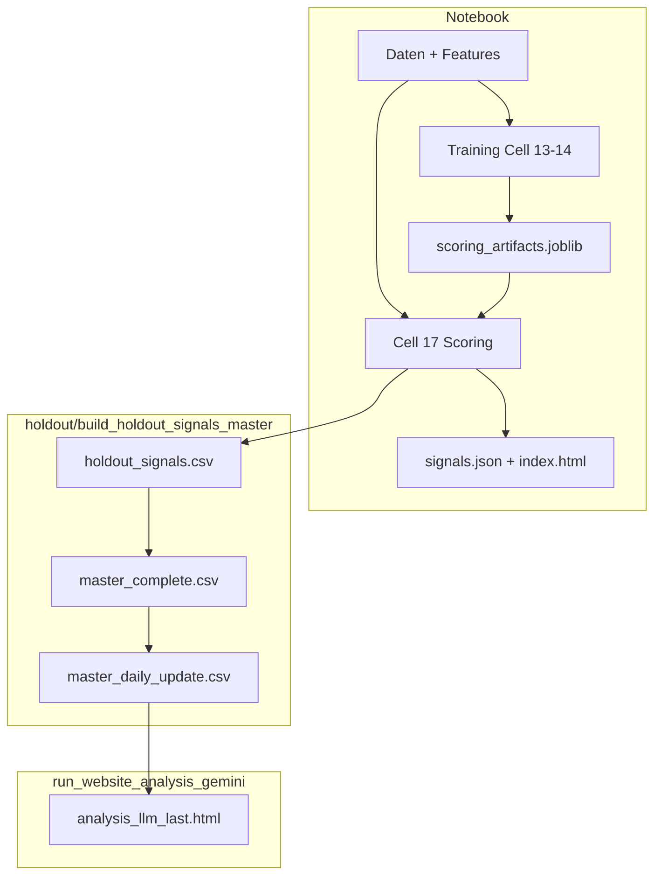

# Systemreferenz: stock_rally — Architektur, Datenfluss und Rekonstruktion

Dieses Dokument beschreibt das Projekt **stock_rally** so präzise, dass die Logik aus dem Text allein wieder implementierbar ist. Maßgeblich sind der Stand des Repos (Python-Module unter `lib/`, `holdout/`, `scripts/`) und das Notebook `stock_rally_v10.ipynb`.

## Inhaltsverzeichnis

| § | Thema |
|---|--------|
| [1](#1-zweck-des-systems) | Zweck des Systems |
| [2](#2-verzeichnisstruktur-funktional) | Verzeichnisstruktur (funktional) |
| [3](#3-konfiguration-und-umgebung) | Konfiguration und Umgebung |
| [4](#4-persistenz-libscoring_persistpy) | Persistenz (`lib/scoring_persist.py`) |
| [5](#5-notebook-stock_rally_v10ipynb--zellenfolge-logisch) | Notebook — Zellenfolge & [Jupyter-Index](#jupyter-zellindex-notebook-json) |
| [6](#6-signal-logik-im-notebook-rekonstruktion) | Signal-Logik im Notebook |
| [7](#7-holdout-pipeline-holdoutbuild_holdout_signals_masterpy) | Holdout-Pipeline (`holdout/build_holdout_signals_master.py`) |
| [8](#8-libsignal_extra_filterspy) | `lib/signal_extra_filters.py` |
| [9](#9-libwebsite_rally_promptpy) | `lib/website_rally_prompt.py` |
| [10](#10-website--gemini) | Website & Gemini |
| [11](#11-scriptsanalyze_signals_forwardpy) | `scripts/analyze_signals_forward.py` |
| [12](#12-scriptsappend_git_pushpy) | `scripts/append_git_push.py` |
| [13](#13-statische-website-docs) | Statische Website (`docs/`) |
| [14](#14-datenfluss-übersicht) | Datenfluss (Übersicht) |
| [15](#15-rekonstruktions-checkliste) | Rekonstruktions-Checkliste |
| [16](#16-versionshinweis) | Versionshinweis |

**Navigation im Notebook:** In der JSON-Datei `stock_rally_v10.ipynb` sind **Zeilennummern nicht stabil** (jedes Speichern kann sie ändern). Zuverlässig sind der **Jupyter-Zellindex** (0-basiert, siehe [§5.1](#jupyter-zellindex-notebook-json)) und die Suche nach Kommentaren wie `# Cell 2 —` oder `# Cell 17 —`.

---

## 1. Zweck des Systems

- **Primär**: Heterogenes **Stacking** (XGBoost + LightGBM + RandomForest/… als Basismodelle → **XGBoost Meta-Classifier**) auf tabellarischen Features (Kurs, Indikatoren, Sentiment) pro Ticker/Tag; binäres **Rally-Label** (kurzfristige Kursrally gemäß konfigurierbarem Fenster und Schwelle).
- **Ausgabe**: Wahrscheinlichkeiten `prob` je Zeile; nach **Schwellenwert** und **Signal-Filtern** (Konsekutivität, Cooldown, optional Anti-Peak/RSI) entstehen **Signale**; Export als **GitHub Pages**-Website (`docs/index.html`, `docs/signals.json`) und optional **LLM-Analyse** (Gemini) auf Basis von CSV + Prompt.

---

## 2. Verzeichnisstruktur (funktional)

| Pfad | Rolle |
|------|--------|
| `stock_rally_v10.ipynb` | Zentrale Orchestrierung: Daten, Features, Training, Scoring, HTML-Export |
| `lib/` | Wiederverwendbare Bibliothek (`scoring_persist`, `signal_extra_filters`, `website_rally_prompt`) |
| `holdout/` | CLI-Pipeline für Holdout-CSVs (Master-CSV, Forward-Renditen, Filter) |
| `scripts/` | Website-Gemini (`run_website_analysis_gemini.py`), `website_analysis_common.py`, `analyze_signals_forward.py`, `append_git_push.py` |
| `config/` | `load_env.py` (`.env` / `config/secrets.env`), `env.example` |
| `data/` | CSV-Ein-/Ausgaben (git-ignoriert außer wo explizit eingecheckt) |
| `docs/` | Statische Website + `website_analysis_prompt.txt`, `analysis_llm_last.*` |
| `models/` | `scoring_artifacts.joblib` (Trainingsbundle), ggf. JSON-Snapshots |
| `figures/` | Von Skripten erzeugte Plots (z. B. KDE) |

**Projektroot** muss auf `sys.path` liegen (Notebook Zelle 2: `Path.cwd()`), damit `import lib.…` und `import holdout.…` funktionieren.

---

## 3. Konfiguration und Umgebung

### 3.1 `config/load_env.py`

- **`load_project_env(project_root: Path | None)`**  
  - `root = project_root or Path(__file__).resolve().parent.parent` (Repo-Root).  
  - Liest nacheinander, falls vorhanden: `<root>/.env`, `<root>/config/secrets.env`.  
  - Pro Zeile: Leerzeilen/`#` überspringen; optional `export KEY=val`; `KEY=val` parsen; **`os.environ.setdefault(key, val)`** — bestehende Variablen werden **nicht** überschrieben.

### 3.2 Relevante Umgebungsvariablen (Auswahl)

| Variable | Verwendung |
|----------|------------|
| `GEMINI_API_KEY` | `scripts/run_website_analysis_gemini.py` |
| `GEMINI_MODEL` | Optional, Default z. B. `gemini-2.5-flash` (mit/ohne `models/`-Präfix) |
| `GEMINI_NO_SEARCH` | Wenn `1`/`true`/`yes`: Gemini **ohne** Google Search |
| `ANALYSIS_MAX_TICKER_ROWS` | `website_analysis_common.read_signals_for_latest_day`: max. Zeilen (Default 40) |

---

## 4. Persistenz: `lib/scoring_persist.py`

### 4.1 Hilfsfunktion `_max_date_iso_from_threshold_df(df)`

- Eingabe: DataFrame mit Spalte **`Date`** (oder `None`).  
- Ausgabe: `str(pd.to_datetime(df["Date"]).max().date())` oder `None` bei Fehler.

### 4.2 `save_scoring_artifacts(g, path=None) -> Path`

- **`path`**: `Path(path or g.get("SCORING_ARTIFACT_PATH") or "models/scoring_artifacts.joblib")`.  
- Setzt `g["threshold_calibration_end_date"]`: aus `g` oder aus Max-Datum von `g["df_threshold"]`.  
- **Bundle (joblib)** — Schlüssel und Quellen:

| Schlüssel | Quelle in `g` |
|-----------|----------------|
| `base_models` | Liste von Tupeln `(name, model, mtype)` mit `mtype` in `xgb`, `lgb`, … |
| `meta_clf` | Trainierter Meta-Classifier (z. B. XGBoost) |
| `best_threshold` | `float` |
| `FEAT_COLS` | Liste Spaltennamen Features |
| `topk_idx` | `numpy` Array Indizes für SHAP-Top-K-Rohfeatures |
| `topk_names` | Liste Namen |
| `best_params` | `dict` (Optuna/Seed, u. a. Rally-Parameter) |
| `tickers_for_run` | `list` aus `g.get("_tickers_for_run")` |
| `CONSECUTIVE_DAYS`, `SIGNAL_COOLDOWN_DAYS` | `int` |
| `rsi_w`, `bb_w`, `sma_w` | `int` |
| `signal_skip_near_peak`, `peak_lookback_days`, `peak_min_dist_from_high_pct`, `signal_max_rsi` | Signal-Filter-Metaparameter |
| `threshold_calibration_end_date` | ISO-Datum oder `None` |

- Schreibt mit `joblib.dump`; druckt Pfad und Threshold.

### 4.3 `load_scoring_artifacts(g, path=None) -> Path`

- Lädt Bundle; schreibt alle obigen Felder in **`g`** (Mapping/Namespace).  
- Definiert **lokal** und hängt an `g` an:
  - **`_predict_base_logged(model_tuple, X, dataset_label)`**:  
    - `xgb`: `1/(1+exp(-predict(DMatrix(X))))`  
    - `lgb`: `1/(1+exp(-predict(X)))`  
    - sonst: `predict_proba(X)[:,1]`  
  - **`build_meta_features(X_feat, dataset_label)`**: horizontaler Stack  
    `[alle Base-Probs als Spalten] + X_feat[:, topk_idx]` → `float32`.  
- Setzt `g["_SCORING_ARTIFACTS_LOADED"] = True`.

**Rekonstruktion**: Meta-Input-Dimension = `Anzahl Base-Modelle + len(topk_idx)`.

---

## 5. Notebook `stock_rally_v10.ipynb` — Zellenfolge (logisch)

Die folgende Tabelle ist die **empfohlene Ausführungsreihenfolge**. Zellen mit Training werden bei `SCORING_ONLY=True` übersprungen (nur Meldung).

| Kommentar in Zelle | Inhalt (kurz) |
|--------------------|----------------|
| **Cell 1** | Imports (numpy, pandas, sklearn, xgboost, lightgbm, optuna, matplotlib, yfinance, …) |
| **Cell 2** | `sys.path` ← Projektroot; Konfiguration (`START_DATE`, `END_DATE`, `SCORING_ONLY`, `SCORING_ARTIFACT_PATH`); Wrapper **`save_scoring_artifacts`** / **`load_scoring_artifacts`** um `lib.scoring_persist`; Flag `_SCORING_ARTIFACT_SAVED_THIS_SESSION`; Ticker-Universe, Sektoren; u. a. Konstante `META_SHAP_TOP_K` (Kommentar „Cell 13a“ bezieht sich nur auf die **Konfiguration** für die spätere SHAP-Phase) |
| **Cell 3** | Hilfsfunktionen (nicht trivial: partitionierte Daten, etc.) |
| **Cell 4** | Rohdaten laden (BigQuery/yfinance je nach Setup) |
| **Cell 5** | Target-Erzeugung (`create_target`-Logik, konsistent mit Training) |
| **Cell 6** | Technische Indikatoren |
| **Cell 7** | News/Sentiment (z. B. GDELT/BigQuery) |
| **Cell 8** | Feature-Matrix assemblieren → `df_features` |
| **Cell 9** | Optuna (Basis-XGBoost) — Phasen 1–2 im weiteren Sinne |
| **Cell 10** | Plot-Funktionen Holdout |
| **Cell 11** | Pipeline: bei `SCORING_ONLY` → `load_scoring_artifacts()`; sonst Daten-Splits (Walk-forward: TRAIN_BASE, TRAIN_META, THRESHOLD, FINAL), `df_train_*`, `df_threshold`, `df_final`, … |
| **Cell 13** (8b) | Bei nicht-SCORING_ONLY: Optuna Base-Modelle (Phasen 1–2); **innerhalb derselben Code-Zelle** anschließend Phase 3 **SHAP** (im Kommentar „13a“) → `topk_idx`, `topk_names`; Start setzt `_SCORING_ARTIFACT_SAVED_THIS_SESSION = False` |
| **Cell 14** (8c) | Meta-Features, Meta-Optuna (Phase 4), Meta-Modell `meta_clf`, **Phase 5** Threshold auf THRESHOLD-Set → `best_threshold`; **`save_scoring_artifacts()`**; Hinweis-Print |
| **Cell 13b** | Regime-Evaluation (optional, kein Training) |
| **Cell 13** (8d) | Threshold-Analyse / Lesen (Kommentar „8d“) |
| **Cell 15** | Holdout-Plots (FINAL) |
| **Cell 17** | Volllauf-Scoring auf `df_features`, Signale, Charts, `docs/index.html`, `docs/signals.json`, optional subprocess Gemini |
| **Cell 18** | Optional manuelles erneutes Speichern (`lib.scoring_persist.save_scoring_artifacts`) |

**Wichtig**: Die **fachliche** Trainingskette endet mit **Phase 5 in Cell 14**; dort wird das Artefakt automatisch geschrieben.

### 5.1 Jupyter-Zellindex (0-basiert, `stock_rally_v10.ipynb`)

Die Tabelle mappt den **Index im `cells`-Array** der Notebook-JSON-Datei auf die erste Code-/Markdown-Zeile bzw. die logische „Cell N“-Bezeichnung. So lässt sich der Code in VS Code/Cursor („Notebook-Zelle N“) oder per Skript zuverlässig adressieren — **nicht** über feste Dateizeilen.

| Index | `cell_type` | Logische Zelle / Anker zum Suchen |
|------:|-------------|-------------------------------------|
| 0 | `markdown` | Titel: `# Heat Pump Stock Rally Prediction` |
| 1 | `code` | `# Cell 1 — Imports` |
| 2 | `code` | `# Cell 2 — Configuration` |
| 3 | `code` | `# Cell 3 — Helpers` |
| 4 | `code` | `# Cell 4 — 1: Load stock data` |
| 5 | `code` | `# Cell 5 — 2: Target vector` |
| 6 | `code` | `# Cell 6 — 3: Technical indicators` |
| 7 | `code` | `# Cell 7 — 4: News sentiment` |
| 8 | `code` | `# Cell 8 — 5: Assemble feature matrix` |
| 9 | `code` | `# Cell 9 — 6: Optuna optimisation` |
| 10 | `code` | `# Cell 10 — 7: Holdout plot function` |
| 11 | `code` | `# Cell 11 — 8: Run pipeline` |
| 12 | `code` | `if globals().get('SCORING_ONLY'…` → **Cell 13 (8b)** inkl. Phase 3 SHAP; erstes Kommentar: `# Cell 13 — 8b:` |
| 13 | `code` | **Cell 14 (8c)** Meta + Phase 5 + Speichern; erstes Kommentar: `# Cell 14 — 8c:` |
| 14 | `code` | **Cell 13b** Regime; `# Cell 13b —` |
| 15 | `code` | **Cell 13 (8d)** Threshold-Analyse; `# Cell 13 — 8d:` |
| 16 | `code` | **Cell 15** Holdout-Plots; `# Cell 15 — 8d:` |
| 17 | `code` | `# Cell 17 — Daily Scoring & HTML Export` |
| 18 | `code` | `# Cell 18 — Artefakt manuell speichern` |

**Hinweis:** Die Indizes **12–16** beginnen sichtbar mit `if globals().get('SCORING_ONLY', False):` — der **Trainingstext** steht im `else`-Zweig. Bei `SCORING_ONLY=True` wird nur die Skip-Meldung ausgeführt.

---

## 6. Signal-Logik im Notebook (Rekonstruktion)

### 6.1 `apply_signal_filters(df_ticker_prob, threshold, consecutive_days=None, signal_cooldown_days=None)`

**Eingabe**: Ein Ticker, sortiert nach `Date`; Spalte `prob`; optional `close` für RSI/Peak-Filter.

**Schritte**:

1. `cd = CONSECUTIVE_DAYS` bzw. Argument; `scd = SIGNAL_COOLDOWN_DAYS` bzw. Argument.  
2. `raw[i] = 1` wenn `prob[i] >= threshold`, sonst 0.  
3. **Konsekutivität**: Für `i >= 2`: `consec[i] = 1` wenn `raw[i-2] + raw[i-1] + raw[i] >= cd` (Summe der drei aufeinanderfolgenden Roh-Treffer muss mindestens `cd` sein — exakt wie im Code).  
4. **Cooldown**: Durchlauf `i = 0..n-1`: wenn `consec[i]==1` und `(i - last_signal) >= scd`, setze `final[i]=1` und `last_signal = i`.  
5. Wenn `close` vorhanden: RSI aus Close (`_rsi_from_close_1d` mit `rsi_w`), Maske `_peak_rsi_mask_1d(...)` mit `SIGNAL_SKIP_NEAR_PEAK`, `PEAK_LOOKBACK_DAYS`, `PEAK_MIN_DIST_FROM_HIGH_PCT`, `SIGNAL_MAX_RSI`; für Indizes mit `final[i]==1` und nicht Maske: `final[i]=0`.  

**Ausgabe**: `df_s.loc[final == 1, 'Date'].values` (NumPy-Datumswerte der Signal-Tage).

### 6.2 Scoring in Cell 17 (konzeptionell)

- `df_s = df_features` (validierte Zeilen) mit `FEAT_COLS`.  
- `X_meta_all = build_meta_features(feat_arr, 'FULL HISTORY')`.  
- `probs_all = meta_clf.predict_proba(X_meta_all)[:, 1]` → `df_s['prob']`.  
- Pro Ticker: `apply_signal_filters(sub, best_threshold)` → Liste Signaldaten.  
- Holdout-Schnittmenge mit `df_final` für unverzerrte OOS-Liste `signals_holdout_final`.

---

## 7. Holdout-Pipeline: `holdout/build_holdout_signals_master.py`

**Projektroot** `ROOT = Path(__file__).resolve().parents[1]`; `sys.path.insert(0, str(ROOT))`.

### 7.1 Konstanten

- `HORIZONS = (2, 4, 6, 8, 10)` Handelstage.  
- `YF_START = "2018-01-01"`.  
- Pfade: `data/holdout_signals.csv`, `data/master_complete.csv`, `data/master_daily_update.csv`, `models/scoring_artifacts.joblib`.

### 7.2 `next_trading_day_after(signal_d, dates)`

- `signal_d` normalisiert; erste Datum in `dates` **strikt nach** `signal_d`.  
- Rückgabe: normalisiertes Timestamp oder `None`.

### 7.3 Forward-Renditen (pro Signalzeile)

- Für jeden Ticker OHLC aus Bulk-`yf.download`; pro Signal:  
  - `entry = next_trading_day_after(signal_date, df.index)`.  
  - Wenn gültig: `o_ent = Open` am Entry-Index (float).  
  - Für jedes `h` in `HORIZONS`: Index `j = pos + h` (pos = Index von `entry` in `dates`); wenn `j < len`: `ret_h = Close[j] / o_ent - 1`, sonst NaN.  
  - `ret_mean_5`: Mittel der fünf `ret_{h}d`, **nur wenn alle fünf endlich**.

### 7.4 `create_target_one_ticker(close, rw, rt, ld, ed, mt)`

**Parameter**: `close` numpy; `rw` Fensterlänge; `rt` Mindest-**kumulative** Rendite über `rw` Tage; `ld` Lead-Tage; `ed` Entry-Tage; `mt` Mindestlänge Rally-Segment.

**Algorithmus (vereinheitlicht)**:

1. `daily_ret[i] = close[i]/close[i-1]-1` für `i>=1`.  
2. Für `i` von `rw-1` bis `n-1`: kumulierte Rendite über Fenster `[i-rw+1, i]` als Produkt `(1+r_j)` minus 1 → `cum_ret[i]`.  
3. `rally[i]=1` wenn `cum_ret[i] >= rt`; dann werden alle Indizes im Fenster auf Rally gesetzt (Band).  
4. **target** (binär): Iteration über Rally-Segmente (Wechsel 0→1); für jedes Segment `[start,end]` mit Länge `>= mt`:  
   - Label `1` für Indizes `[pre_start, start)` mit `pre_start = max(0, start-ld)` (Vorlauf),  
   - und für `k in [start, min(n, end+1, start+ed))` wenn Restsegment `>= mt` (exakte Schleifenlogik im Code).  

Rückgabe: `(rally, target)` als `int8`-Arrays.

### 7.5 Trainingslabel-Spalten in der Master-CSV

- Wenn `ARTIFACT` existiert: `best_params` aus Joblib → `return_window`, `rally_threshold`, `lead_days`, `entry_days`, `min_rally_tail_days`.  
- Pro Ticker: `create_target_one_ticker` auf Close-Serie; Zuordnung per Signaldatum zu `train_target` und `rally`.

### 7.6 Zusatzfilter

- Wenn `WITH_FILTERS` (nicht `--no-filters`): `lib.signal_extra_filters.enrich_signal_frame(sig, raw)`; Spalten an `out` anfügen; `ensure_llm_signal_columns(out)`.

### 7.7 Ausgabe

- `master_complete.csv` = volle Tabelle.
- `master_daily_update.csv` = nur Zeilen mit **max(Date)**; feste LLM-Spaltenliste (ohne Forward-Renditen und ohne Trainingslabels).

---

## 8. `lib/signal_extra_filters.py`

### 8.1 Zweck

Berechnet **nur aus Signal-Tabelle + yfinance-Rohmatrix** erklärende Spalten (Liquidität, Cluster, Sektor-HHI, Korrelation, Cross-Section-Ranks, OHLCV-Technik, Earnings-Fenster, relative Stärke vs. SPY/Sektor-ETF, Gap, Short Interest / institutionelle Quote), damit ein LLM sie aus der CSV lesen kann.

### 8.2 `ensure_llm_signal_columns(out)`

- Stellt für feste Mengen `_LLM_EXTRA_COLS` und `_OHLC_LLM_COLS` fehlende Spalten bereit (NaN, `False`, `unknown`, `pd.NaT` je nach Spalte).

### 8.3 `enrich_signal_frame(sig, raw, corr_lookback=60)`

**Eingabe**: `sig` mit mindestens `ticker`, `Date`, `prob`, `threshold_used`, `sector`; `raw` MultiIndex-yfinance wie Bulk-Download.

**Ablauf (Reihenfolge)**:

1. `meta_prob_margin(prob, threshold_used)` pro Zeile.  
2. `cluster_counts` → Signale pro Tag, pro Sektor, Anteile, HHI.  
3. `_sector_metrics_by_date` → Merge.  
4. Close-Matrix aus `raw` pro Ticker → `cluster_mean_corr_60d` via `cluster_mean_corr_by_date` (Rolling-Korrelationen).  
5. `cluster_corr_pairwise_valid` wenn `signals_same_day >= 2`.  
6. `adv_currency_20d` pro Zeile; daraus Perzentil-/Rang-Spalten pro Tag; `liquidity_tier`.  
7. Cross-Section: `rank_prob_same_day`, `pct_rank_prob_same_day`, `prob_zscore_same_day`, `prob_z_within_sector` (Z nur innerhalb `sector` am selben Tag).  
8. Earnings: `next_earnings_date` (yfinance calendar, gecacht), `bdays_to_next_earnings`, Flags für Fenster 3–15 bdays, etc.  
9. `_merge_ticker_date_features(raw, out)`: OHLCV-Features (Volatilität, Momentum, Abstand zu 20d-High/Low, MA200, BB-Breite, Trend-Efficiency, Amihud, …) per Ticker/Zeile.  
10. `_add_rs_gap_short_columns`: `ret_vs_spy_5d/20d`, `ret_vs_sector_5d/20d`, `open_gap_pct`, sowie per `yf.Ticker(...).info` (gecacht) `short_float_pct`, `short_days_to_cover`, `inst_own_pct` (Prozent 0–100).  
11. `_add_market_sector_bench_columns`: pro Zeile `market_bench_symbol` / `sector_bench_symbol`, `market_ret_1d/2d/3d` und `sector_ret_1d/2d/3d`, `news_sentiment` (Platzhalter NaN).  
12. `_add_beta_alpha_columns`: Rolling-60d-Beta und 5d-Alpha vs. Leitindex bzw. Sektor-ETF (`beta_mkt_60d`, `alpha_mkt_5d`, `beta_sec_60d`, `alpha_sec_5d`).  
13. `_add_short_horizon_macro_regime_columns`: `regime_vix_level`, `regime_vix_ret_1d/5d`, `regime_vix_z_20d`, `regime_spy_realvol_5d_ann`, `regime_tnx_ret_5d`.

**Ausgabe**: erweiterter DataFrame (linksbündig auf `sig`); abschließend `ensure_llm_signal_columns`.

---

## 9. `lib/website_rally_prompt.py`

- **`load_rally_prompt_injection(root)`** lädt `root/models/scoring_artifacts.joblib` (ohne `load_scoring_artifacts`-API), liest `best_params` und Filterkonstanten (`CONSECUTIVE_DAYS`, `SIGNAL_COOLDOWN_DAYS`) und formatiert einen **Markdown-Block** für den LLM-Prompt (Rally-Definition, Fokus kurzfristig).

---

## 10. Website & Gemini

### 10.1 `scripts/website_analysis_common.py`

- Konstanten: `ROOT = Path(__file__).parents[1]`; Pfade zu `docs/`, `data/master_daily_update.csv`, `master_complete.csv`, `holdout_signals.csv`, Ausgabe `analysis_llm_last.txt/html`.  
- **`read_signals_for_latest_day()`**: Liest erste vorhandene CSV-Priorität `DAILY` → `COMPLETE` → `META_LEGACY` → `HOLDOUT`; nimmt **neuestes Datum**; filtert `prob >= threshold_used`; kappt auf `ANALYSIS_MAX_TICKER_ROWS` (nach `prob` sortiert).  
- **`llm_answer_to_fragment_html`**: Markdown-ähnlicher Text → HTML-Fragment (Überschriften, Listen, Code, Zitate).  
- **`analysis_text_to_html(text, provider_line)`**: Wrapper mit `
`, Disclaimer.

### 10.2 `scripts/run_website_analysis_gemini.py` — `main()`

1. `load_project_env(ROOT)`; `GEMINI_API_KEY` Pflicht.  
2. `PROMPT_FILE` lesen; `load_rally_prompt_injection(ROOT)`; Prompt = Rally-Block + `---` + statischer Prompt.  
3. `read_signals_for_latest_day()` → `latest`, `sub`; Abbruch wenn leer.  
4. CSV temporär schreiben; **Google GenAI File API** upload; warten bis `ACTIVE`.  
5. `contents = [user_block_string, uploaded_file]`.  
6. Default: `GenerateContentConfig` mit `GoogleSearch`; bei `GEMINI_NO_SEARCH` nur Plain-Config.  
7. **`_generate_content_retry`**: bis 4 Versuche, Backoff bei retry-fähigen Fehlern (429, 5xx, Timeout, …).  
8. Bei Fehler mit Search: Fallback **ohne** Search, erneut Retry.  
9. Antworttext → `OUT_TXT`, `analysis_text_to_html` → `OUT_HTML`.  
10. `finally`: Upload löschen, Tempfile entfernen.

---

## 11. `scripts/analyze_signals_forward.py`

- Liest `docs/signals.json` (oder `--json`).  
- Pro Signal: Yahoo Chart API v8 (`query1.finance.yahoo.com/v8/finance/chart/...`) für Ticker und Benchmark; Forward-Rendite über **Handelstage** nach Signaltag.  
- Zweck: Analyse **ohne** das Notebook; kein Schreiben der Master-CSV.

---

## 12. `scripts/append_git_push.py`

- Sucht im Notebook die Zelle mit `Cell 17` und `full history edition`.  
- Hängt einen **Python-Block** an (Git add/commit/push für `docs/`-Dateien) — Entwickler-Hilfsmittel; `_repo = str(Path.cwd().resolve())` im eingefügten Block.

---

## 13. Statische Website (`docs/`)

- **`index.html`**: Wird in **Notebook Cell 17** generiert (Signale, Chips, eingebettete Charts als Base64, Sidebar für KI-HTML, Einbindung `analysis_llm_last.html` per Platzhalter-Ersetzung).  
- **`signals.json`**: `generated`, `threshold`, `signals`, `signals_holdout_final`, `note`.  
- **`website_analysis_prompt.txt`**: Statischer deutschen Prompt für Gemini; Spalten müssen zu CSV passen (`signal_extra_filters` + `ensure_llm_signal_columns`).  
- **`manifest.json`**: PWA-Manifest.

---

## 14. Datenfluss (Übersicht)

---

## 15. Rekonstruktions-Checkliste

1. **Projektroot** für alle relativen Pfade; `sys.path` für `lib` und `holdout`.  
2. **Gleiche Spalten** `FEAT_COLS` beim Trainieren und Scoren; **gleiche** `build_meta_features`-Reihenfolge (Base-Probs + Top-K-Features).  
3. **Rally-Label** im Notebook und **`create_target_one_ticker`** in `build_holdout_signals_master` müssen **dieselben Parameter** aus `best_params` nutzen.  
4. **Signal-Filter**: identische Reihenfolge Roh → Konsekutivität (3-Tage-Summe) → Cooldown → optional Peak/RSI.  
5. **Artefakt**: exakt die in Abschnitt 4.2 aufgeführten Schlüssel; Loader muss `build_meta_features` identisch zum Training rekonstruieren.  
6. **Gemini**: Umgebung + CSV-Pfad-Hierarchie in `read_signals_for_latest_day` nicht brechen.

---

## 16. Versionshinweis

- Konkrete Hyperparameter-Listen (Optuna-Räume, alle Feature-Namen) stehen **im Notebook** und in **`best_params`** im Artefakt; dieses Dokument beschreibt **Struktur und Algorithmen**, nicht jeden Tuning-Wert. Für eine 1:1-Replikation zusätzlich `models/scoring_artifacts.joblib` (nach Freigabe) und die jeweilige Notebook-Version heranziehen.
